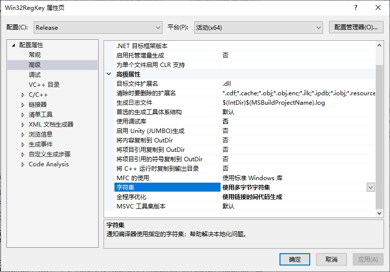

由于 `Windows API` 使用的字符串参数可能是 `LPWSTR` 类型，该类型与 `char*` 类型不兼容，导致运行报错。可以通过如下设置解决：

1）在 `Visual studio` 的解决方案管理器中右击项目名称，在弹出的菜单中选择属性菜单。

2）在 `Win32RegKey` 属性页对话框中，选中 `配置属性` -> `高级`，在右边栏中找到 `高级属性` -> ` 字符集` 项，将该值设置为 `使用多字节字符集` 。

