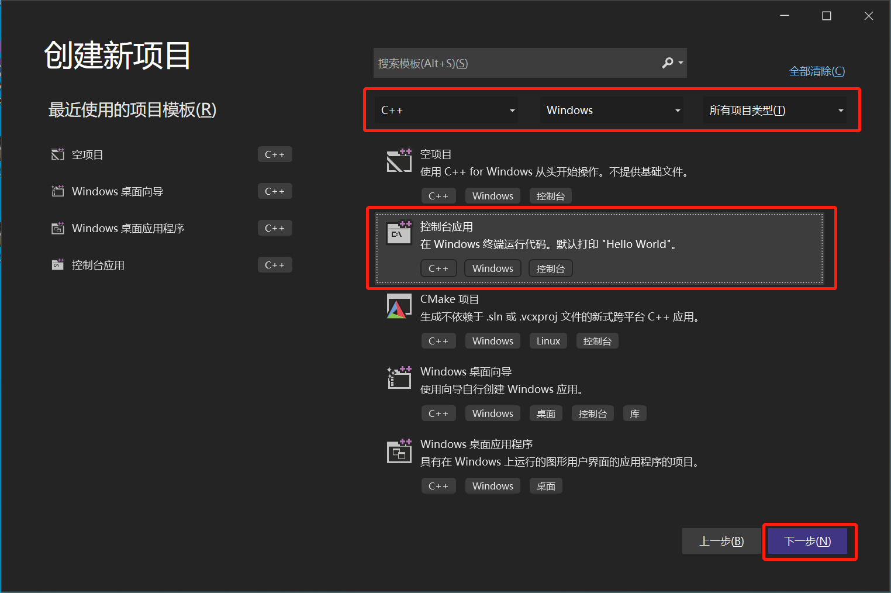
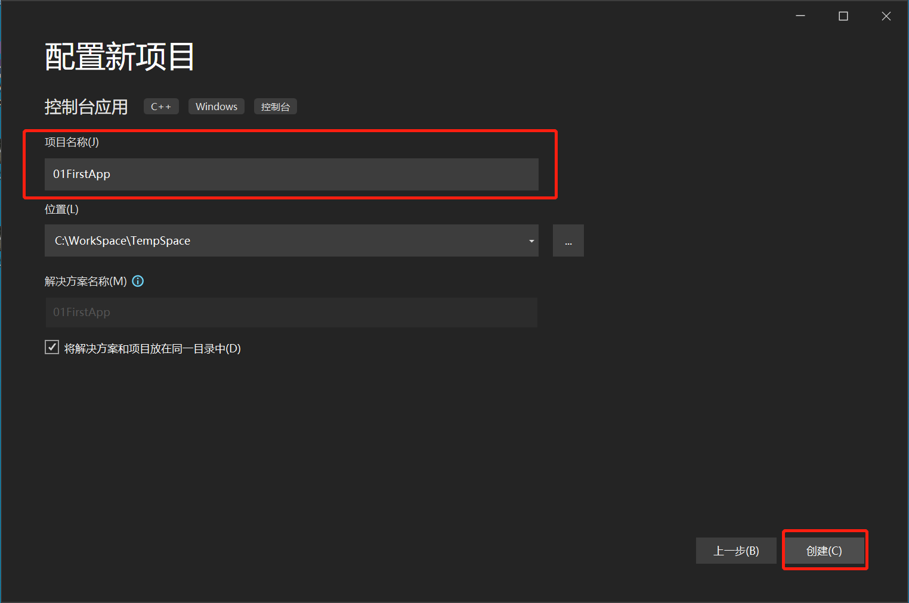

[toc]

### 步骤一



### 步骤二



### 步骤三

编写代码：

**01FirstApp.cpp**

```cpp
#include <stdio.h>
#include <Windows.h>    //  包含 MessageBox 函数声明的头文件

int main(int argc, char* argv[])
{
    // 调用 API 函数 MessageBox
    int nSelect = ::MessageBox(NULL, TEXT("Hello, Windows XP"), TEXT("Greetings"), MB_OKCANCEL);
    if (nSelect == IDOK) 
    {
        printf("用户选择了 “确定” 按钮\n");
    }
    else
    {
        printf("用户选择了“取消”按钮\n");
    }
    return 0;
}
```

