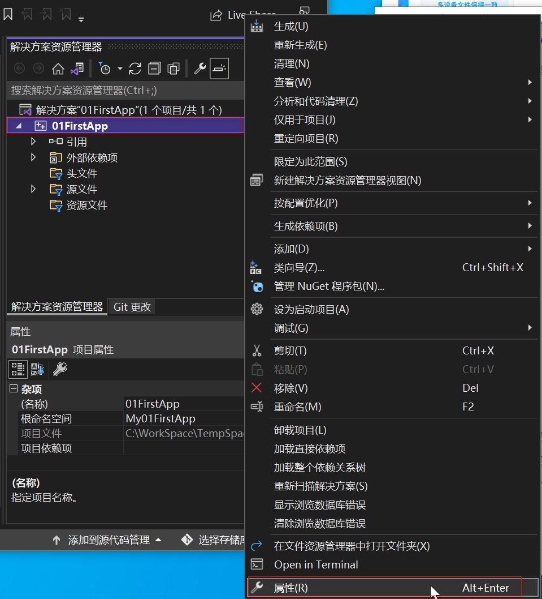
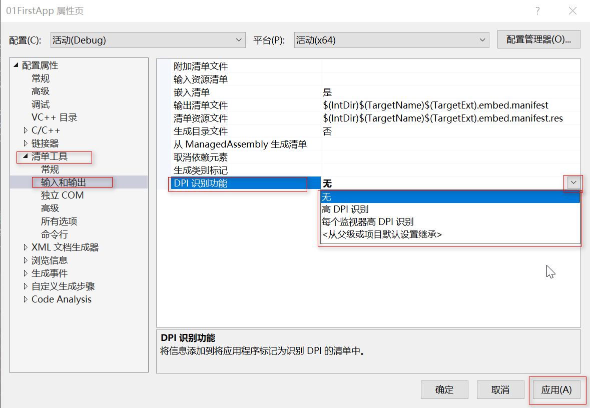

[toc]

### 1. 打开项目属性对话框

在 “解决方案资源管理器” 中，鼠标右击项目名，在弹出的对话框中选择 “属性” 菜单。

### 2. 修改清单设置

在弹出的对话框中选择 "清单工具" -> "输入和输出"，在右边的 ”输入和输出“ 设置中  "DPI 识别功能" 下拉列表中选择 "高 DPI 识别"、"每个监视器高 DPI 识别" 或 "<从父级或项目默认设置继承>"。

