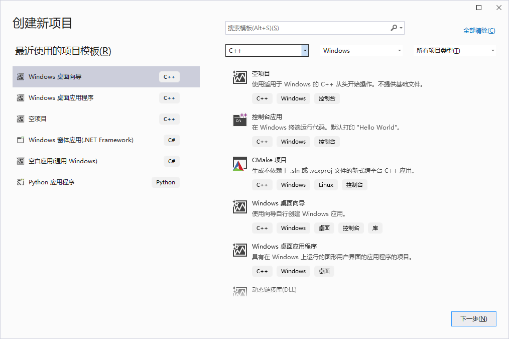
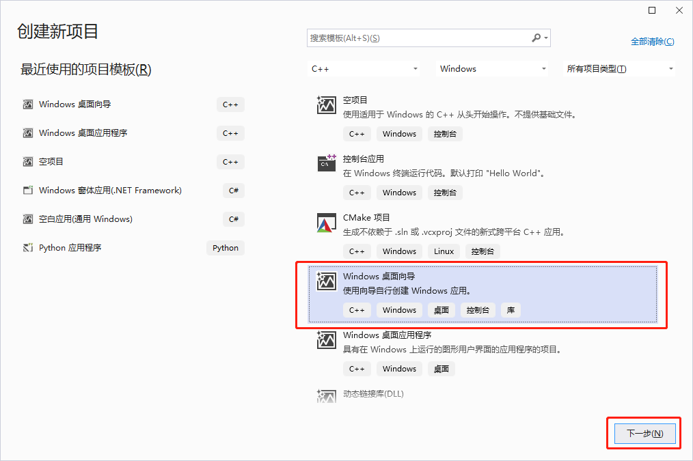
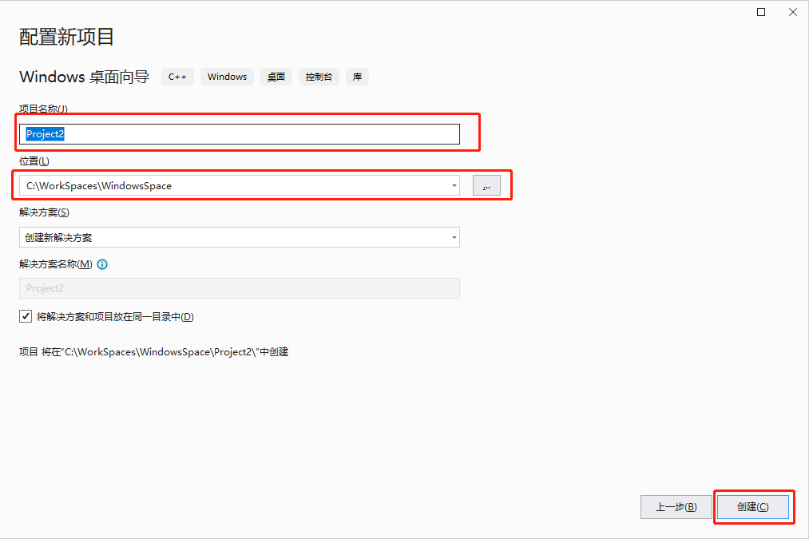
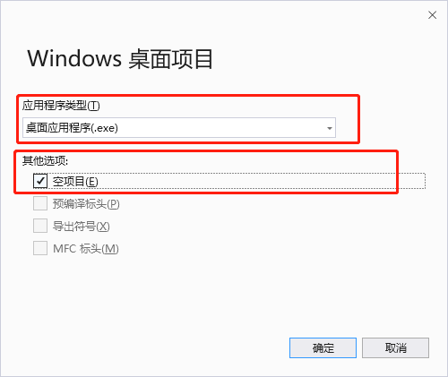
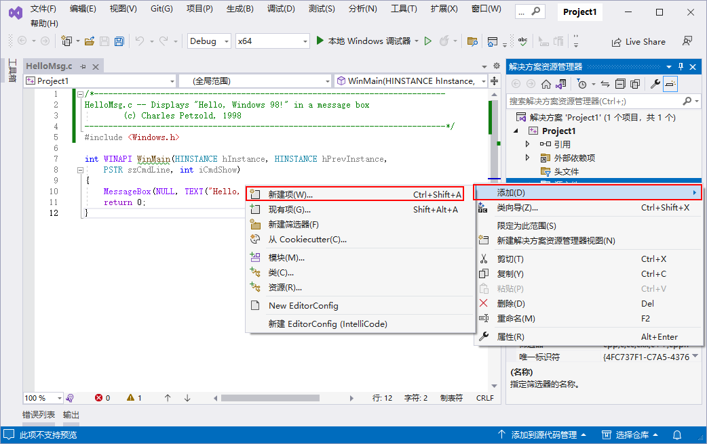
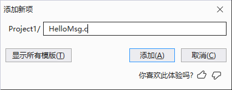
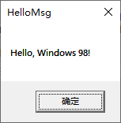

1. 选择 `文件(F)` -> `新建(N)` -> `项目(P)...` 菜单，打开新建项目对话框

   

2. 在对话框的搜索框中输入 `Windows 桌面向导`，或在模版列表中选择 `Windows 桌面向导` 项，然后单击 `下一步` 按钮。

   

3. 在 `配置新项目` 对话框中输入项目名称，选择项目存储位置，然后点击 `创建` 按钮。

   

4. 在弹出的 `Windows 桌面项目` 对话框中的 `应用程序类型(T)` 选择框中选择 `桌面应用程序(.exe)`；在 `其他选项` 中勾选 `空项目`，最后单击 `确定` 按钮。

   

5. 在 `解决方案资源管理器` 中右击源文件，在弹出的菜单中选择 `添加(D)` -> `新建项(W)...` 。

   

6. 在弹出的 `添加新项` 对话框中输入源代码文件名，然后点击 `添加` 按钮。

   

7. 打开 `HelloMsg.c` 文件，输入如下代码

   ```c
   /*--------------------------------------------------------------------------
   HelloMsg.c -- Displays "Hello, Windows 98!" in a message box
   		(c) Charles Petzold, 1998
   ----------------------------------------------------------------------------*/
   #include <Windows.h>
   
   int WINAPI WinMain(HINSTANCE hInstance, HINSTANCE hPrevInstance,
   	PSTR szCmdLine, int iCmdShow)
   {
   	MessageBox(NULL, TEXT("Hello, Windows 98!"), TEXT("HelloMsg"), 0);
   	return 0;
   }
   ```

8. 点击 `本地 Window 调试器` 按钮或按 <kbd>F5</kbd> 快捷键启动调试，运行效果如下：

   

上面示例代码详细解析：

**Windows.h**

`Windows.h` 头文件包含了其他 `Windows` 的头文件，这些头文件中最重要的和最基本的有：

+ `windef.h` ：基本类型定义头文件
+ `winnt.h` ：支持 Unicode 类型的头文件
+ `winbase.h` ：Kernel 头文件
+ `winuser.h`：用户界面头文件
+ `wingdi.h` ：图形界面头文件

**WinMain 函数**

`Windows` 程序的进入点是 `WinMain` ，它的形式如下：

```c
int WINAPI WinMain(HINSTANCE hInstance, HINSTANCE hPrevInstance,
	PSTR szCmdLine, int iCmdShow)
```

`WinMain` 函数在 `/Platform SDK/User Interface Services/Windowing/Windows/Window Reference/Window Functions` 中有说明。它在 `winbase.h` 中声明如下：

```c
int
WINAPI
WinMain (
    _In_ HINSTANCE hInstance,
    _In_opt_ HINSTANCE hPrevInstance,
    _In_ LPSTR lpCmdLine,
    _In_ int nShowCmd
    );
```

`WinMain` 函数声明为返回一个 `int` 值。`WINAPI` 宏在 `windef.h` 中定义，语句如下：

```c
#define WINAPI __stdcall
```

该语句指定了一个调用约定，包括如何生产二进制码以在堆叠中放置函数的参数。许多 `Windows` 函数都声明为 `WINAPI`。

`WinMain` 的第一个参数被称为程序代号。在 `Windows` 程序中，代号仅是一个应用程序用来识别某些东西的数字。在这种情况下，该代号唯一地标识该程序，其他 `Windows` 函数调用可能需要它作为参数。在 `Windows` 的早期版本中，当同时运行同一程序多次时，您便创建了该程序的多个实例。同一应用程序的所有执行实体共用程序和唯一的内存。程序通过检查 `hPrevInstance` 参数就能够确定自身的其他执行实例是否正在运行。然后它可以略过一些繁杂的工作并从前面的执行实体将某些资料移到自己的资料区域。

`WinMain` 的第二个参数总是 `NULL` （定义为 0）。

`WinMain` 的第三个参数是用于执行程序的命令行参数。

`WinMain` 的第四个参数指出程序最初显示的方式。