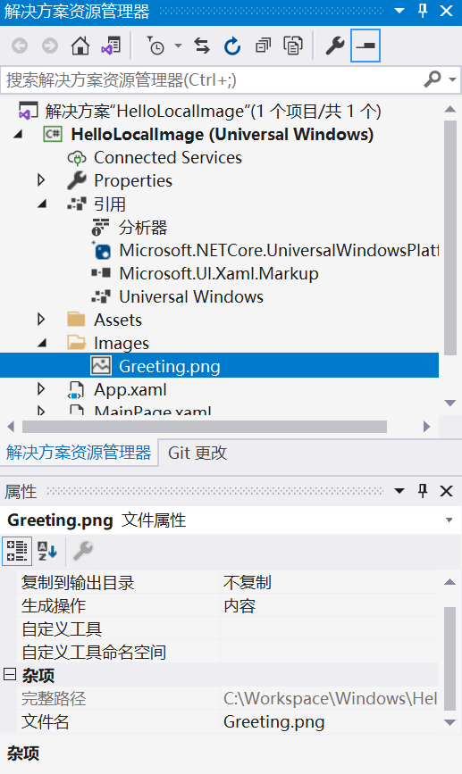

### 1.2 图片的使用

示例项目 HelloImage 通过以下代码从作者的网站上获取一个图片。

**项目：HelloImage | 文件：MainPage.xaml（片段）**

```xml
<Grid>
    <Image Source="http://www.charlespetzold.com/pw6/PetzoldJersey.jpg" />
</Grid>
```

在默认情况下，图片会被缩放以适应可用空间，但会保持图片的原始长宽比。

我们可以通过 Image 类定义的 Stretch 属性来修改这个默认的显示行为。该属性的默认值为枚举成员 Stretch.Uniform。下面我们尝试将其设置为 Fill。

```xml
<Grid>
    <Image Source="http://www.charlespetzold.com/pw6/PetzoldJersey.jpg" 
           Stretch="Fill"
           />
</Grid>
```

将 Stretch 属性设置为 None，则会按原像素值显示图片。

UniformToFill 是 Stretch 属性的第四个选项，可使图片在保持长宽比不变的前提下充满整个容器。

下面我们通过 Windows 的画图程序创建一个简单位图。运行画图程序，单击 ”文件“ | ”属性“，设置图片的大小（如宽 480，高 320）。通过鼠标、手指和笔，我们可以画出自己的问候语。

除了 BMP、JPEG、PNG 和 GIF 这几种常见格式外，Windows Runtime 还支持其他几种。对于上面这张图片，我们不妨将其保存为常见的 PNG 格式，将其命名为 Greeting.png。

下面创建一个新项目，命名为 HelloLocalImage。人们往往愿意将项目用到的图片存储到名为 Images 的目录下。在解决方案资源管理器中，右击项目名称，选择 “添加” | “新建文件夹”。将该文件夹命名为 Images。

右击 Images 文件夹，选择 "添加" | "现有项"。找到刚才保存的 Greeting.png 文件，然后单击 "添加" 按钮。在 Greeting.png 文件添加到项目中之后，我们需要确保其作为应用程序的内容存在。在该文件上右击，选择 "属性"。在 "属性" 窗口中，确认 "生成操作" 的值为 "内容"。



引用该图片的 XAML 标记与之前从网上获取图片所使用的标记类似。

**项目：HelloLocalImage | 文件：MainPage.xaml（片段）**

```xml
<Grid>
    <Image Source="http://www.charlespetzold.com/pw6/PetzoldJersey.jpg" 
           Stretch="Fill"
           />
</Grid>
```

有的程序员也会将存储应用程序位图的文件夹命名为 Assets。您或许已经发现，标准的项目模板已将程序的图标放在 Assets 文件夹。我们同样可以直接利用该文件夹，无需另行创建。

```xml
<Grid>
    <Image Source="http://www.charlespetzold.com/pw6/PetzoldJersey.jpg" 
           Stretch="Fill"
           />
</Grid>
```

