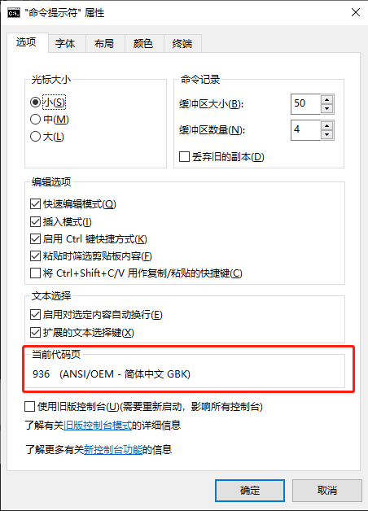
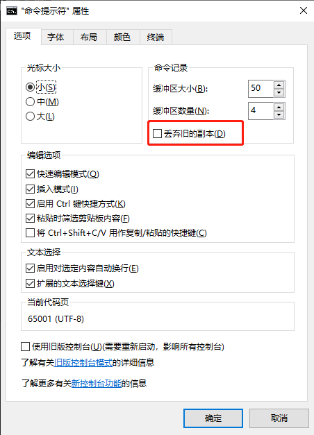

1. 打开 cmd，在命令行输入 chcp，按下回车键，会显示如下信息。（“936” 代表的意思就是 GBK，通常情况下 GBK 也是 cmd 的默认编码。）

   ```shell
   c:\>chcp
   活动代码页: 936
   
   c:\>
   ```

   或者在 cmd 的标题栏单击鼠标右键，选择 “属性”，在 ”属性“ -> ”选项“，一栏中，就可以看到当前代码也的编码方式。

   

2. 为解决乱码问题，我们往往会把编码方式改为 "utf-8"，下面就以此为例。

   2.1 打开 cmd 窗口，在命令行输入 `chcp 65001`。（65001 代表编码格式为 utf-8）

   ```
   Active code page: 65001
   
   c:\>
   ```

   2.2 如果你想一直保持这种编码格式，而非仅限于本次使用，那么还有一步操作：

   打开 “属性” -> “选项”，勾选 “丢弃旧的副本” 这一项。只有选中了这一项，才能在下一次打开 cmd 时，保持编码方式为 utf-8。

   

   