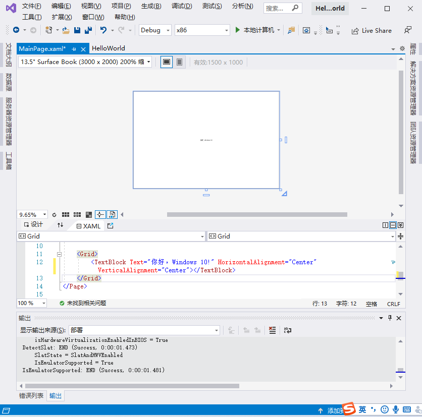
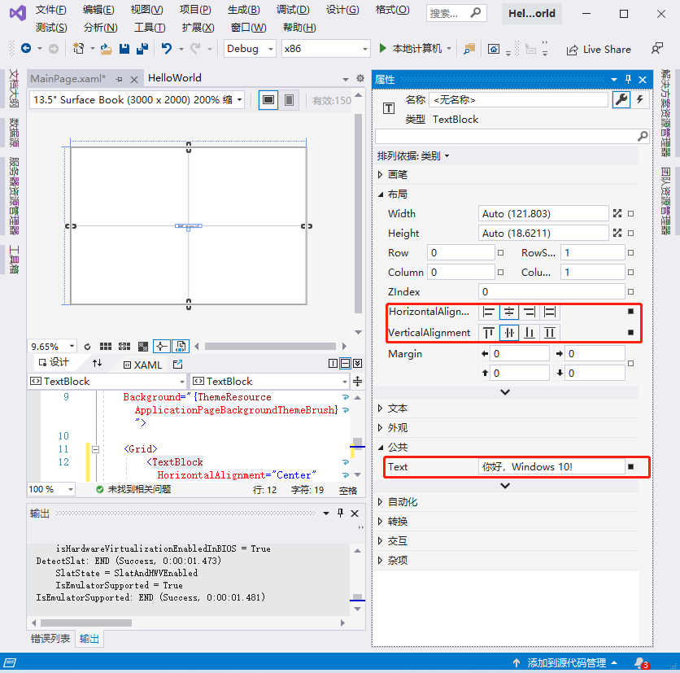
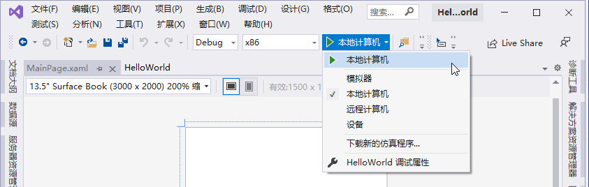
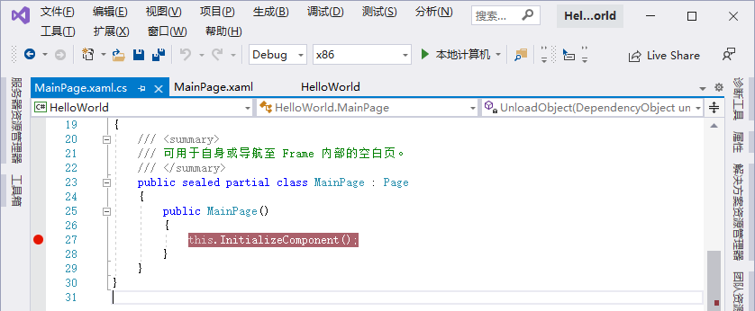

[toc]

### 1. 创建 Hello World 项目

#### 1.1 新建一个 Windows 10 的通用应用程序

打开 Visual Studio 开发工具，选择 `File` 菜单，选择新建一个工程（New Project），在 New Project 中选择 `Templates` -> `Visual C#` -> `Windows` -> `Universal`，在面板中可以选择创建的项目末班，选择一个空白的项目模板 `Blank App(Universal Windows)`，单击 `OK` 按钮完成项目的创建。

#### 1.2 编写程序代码

双击 `解决方案管理器` 中的 `MainPage.xaml` 文件，在中间编辑框中的 `Grid` 控件里面添加一个 `TextBlock` 控件，代码如下：

```xml
<TextBlock Text="你好，Windows 10!" HorizontalAlignment="Center" VerticalAlignment="Center"></TextBlock>
```



除了直接编写代码，也可以通过可视化的编程界面来实现，单击 Visual Studio 左边的工具，把 `TextBlock` 控件拖放到可视化编辑界面，然后选中 `TextBlock` 控件，单击右边的属性窗口，在属性窗口可以对 Text、HorizontalAlignment 和 VerticalAlignment 属性进行设置。



#### 1.3 编译和部署程序

右键解决方案名称（HelloWorldDemo），选择 `Build` 或者 `Rebuild` 选项，表示构建或者重新构建解决方案。可以在工具栏下选择是部署到本地计算机还是模拟器中运行。


#### 1.4 断点调试程序

在任何一个 C# 文件里面，在代码行左侧点击一次就会出现一个红点，这个红点表示是程序的断点。单击工具栏上设备选择下拉框左边的绿色小箭头，程序将会进入到调试状态，当运行断点的时候程序将会被阻塞住，按快捷键 <kbd>F10</kbd> 运行下一步，按快捷键 <kbd>F5</kbd> 将直接跳到下一个断点的位置。



### 2. 解析 Hello World 应用

#### 2.1 MainPage.xaml 文件

```xml
<Page
    x:Class="HelloWorld.MainPage"
    xmlns="http://schemas.microsoft.com/winfx/2006/xaml/presentation"
    xmlns:x="http://schemas.microsoft.com/winfx/2006/xaml"
    xmlns:local="using:HelloWorld"
    xmlns:d="http://schemas.microsoft.com/expression/blend/2008"
    xmlns:mc="http://schemas.openxmlformats.org/markup-compatibility/2006"
    mc:Ignorable="d"
    Background="{ThemeResource ApplicationPageBackgroundThemeBrush}">

    <Grid>
        <TextBlock HorizontalAlignment="Center" Text="你好，Windows 10!" TextWrapping="Wrap" VerticalAlignment="Center"/>
    </Grid>
</Page>
```

在 MainPage.xaml 文件里面可以看到 Page 元素里面也包含相关的属性和命名空间，说明如下：

+ Background="{ThemeResource ApplicationPageBackgroundThemeBrush}"

  Background 表示设置了当前页面的背景，取值为 ThemeResource ApplicationPageBackgroundThemeBrush 则表示当前背景使用的是系统的主题资源背景；它和系统的背景主题一致。也就是说，系统的背景主题修改了，当前页面的背景也会一起改变。所有 Page 元素所指出的属性都可以在这里进行设置（如 FontSize 属性等），在 Page 元素上面设置的属性将会对整个页面的其他元素产生影响。

+ x:Class="HelloWorld.MainPage"

  `x:Class` 表示当前的 XAML 文件关联的后台代码文件是 HelloWorld.MainPage 类，通过这个设置编译器就会自动在项目中找到 HelloWorld.MainPage 类与当前的页面关联起来进行编译。

+ xmlns:local="using:HelloWorld"

  `xmlns:local` 表示当前的页面引入的命名空间标识符，通过该标识符可以在 XAML 页面里面访问所指向的空间的类。

+ xmlns="http://schemas.microsoft.com/winfx/2006/xaml/presentation"

  `xmlns` 代表的是默认的控件，如果在 UI  里面控件没有前缀则代表它属于默认的名字空间。例如，MainPage.xaml 文件里面的 Grid 标签。

+ xmlns:x="http://schemas.microsoft.com/winfx/2006/xaml"

  `xmlns:x` 代表专属的命名空间，例如一个空间里面有一个属性叫 Name，`x:Name` 则代表这个 xaml 的名字空间。

+ xmlns:d="http://schemas.microsoft.com/expression/blend/2008"

  `xmlns:d` 表示呈现一些设计时的数据，而应用真正运行起来时会帮我们忽略掉这些运行时的数据。

+ xmlns:mc="http://schemas.openxmlformats.org/markup-compatibility/2006"

  `xmlns:mc` 表示标记兼容性相关的内容，这里主要配合 `xmlns:d` 使用，它包含 `Ignorable` 属性，可以在运行时忽略掉这些设计时的数据。

+ mc:Ignorable="d"

  `mc:Ignorable="d"` 就是告诉编译器在实际运行时，忽略设计时设置的值。

#### 2.2 MainPage.xaml.cs 文件

```csharp
using System;
using System.Collections.Generic;
using System.IO;
using System.Linq;
using System.Runtime.InteropServices.WindowsRuntime;
using Windows.Foundation;
using Windows.Foundation.Collections;
using Windows.UI.Xaml;
using Windows.UI.Xaml.Controls;
using Windows.UI.Xaml.Controls.Primitives;
using Windows.UI.Xaml.Data;
using Windows.UI.Xaml.Input;
using Windows.UI.Xaml.Media;
using Windows.UI.Xaml.Navigation;

// https://go.microsoft.com/fwlink/?LinkId=402352&clcid=0x804 上介绍了“空白页”项模板

namespace HelloWorld
{
    /// <summary>
    /// 可用于自身或导航至 Frame 内部的空白页。
    /// </summary>
    public sealed partial class MainPage : Page
    {
        public MainPage()
        {
            this.InitializeComponent();
        }
    }
}
```

#### 2.3 App.xaml 文件

```xml
<Application
    x:Class="HelloWorld.App"
    xmlns="http://schemas.microsoft.com/winfx/2006/xaml/presentation"
    xmlns:x="http://schemas.microsoft.com/winfx/2006/xaml"
    xmlns:local="using:HelloWorld">

</Application>
```

在 App.xaml 文件中定义的元素是对整个应用程序是公用的，例如你在 App.xaml 文件中，添加了 `<Application.Resources></Application.Resources>`