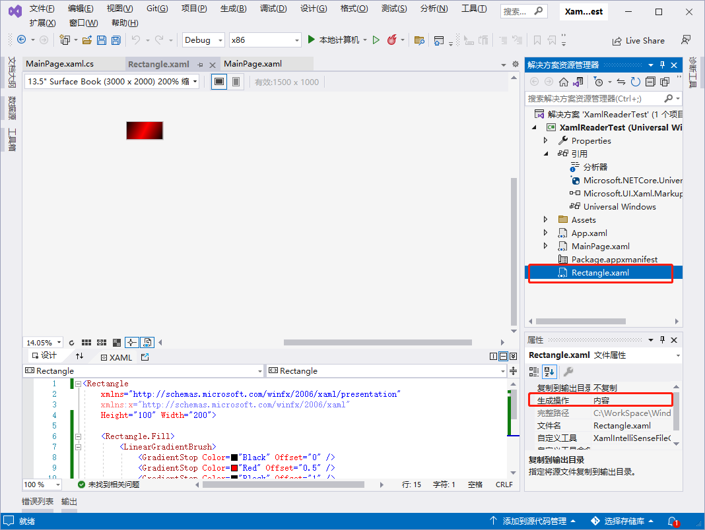

[toc]

### 1. XAML 页面的编译

如果要编译一个 `XAML` 文件并将它与过程式代码混合，第一步就是为 `XAML` 文件的根元素指定一个子类，这可以用 `XAML` 语言命名空间中的 `Class` 关键字来完成，`Windows 10` 的程序页面一般采用这种方式。通常在 `Windows 10` 项目中新增的 `XAML` 文件都会自动生成一个对应的 `XAML.CS` 文件，并且默认地将两个文件关联起来。例如，添加的 `XAML` 文件如下：

```xml
<Page x:Class="App1.MainPage" ...>
	... 省略若干代码
</Page>
```

与 `XAML` 文件关联起来的 `XAML.CS` 文件如下：

```c#
namespace App1
{
    public sealed partial class MainPage : Page
    {
        ... 省略若干代码
    }
}
```

通常把与 `XAML` 文件关联的 `XAML.CS` 文件称为代码隐藏文件。如果添加 `XAML` 中的任何一个事件处理程序（通过事件特性，如 `Button` 的 `Click` 特性），在 `XAML.CS` 文件上就会生成事件的处理事件代码。在类定义中有一个 `partial` 关键字，这个关键字很重要，因为类的实现是分布在多个文件中的。可能你会觉得不可思议，因为在项目里面只看到 `MainPage.xaml.cs` 文件定义了 `MainPage` 类，其实 `MainPage` 类也在另外一个地方定义了，只是在项目工程里面隐藏了而已。当编译完 Windows 10 的项目时，会在项目的 `obj\Debug` 文件夹下看到 `Visual Studio` 创建的以 `g.cs` 为扩展名的文件，对于每一个 `XAML` 文件，可以找到一个对应的 `g.cs` 文件。下面来看一下 `MainPage.g.cs` 文件的结构：

```c#
#pragma checksum "C:\WorkSpace\WindowsSpace\App1\MainPage.xaml" "{8829d00f-11b8-4213-878b-770e8597ac16}" "03B55A7B9FF87DFDD910B54E499E9D8C973960757D6A5BCDD1662057F0783F56"
//------------------------------------------------------------------------------
// <auto-generated>
//     This code was generated by a tool.
//
//     Changes to this file may cause incorrect behavior and will be lost if
//     the code is regenerated.
// </auto-generated>
//------------------------------------------------------------------------------

namespace App1
{
    partial class MainPage : 
        global::Windows.UI.Xaml.Controls.Page, 
        global::Windows.UI.Xaml.Markup.IComponentConnector,
        global::Windows.UI.Xaml.Markup.IComponentConnector2
    {
        /// <summary>
        /// Connect()
        /// </summary>
        [global::System.CodeDom.Compiler.GeneratedCodeAttribute("Microsoft.Windows.UI.Xaml.Build.Tasks"," 10.0.19041.685")]
        [global::System.Diagnostics.DebuggerNonUserCodeAttribute()]
        public void Connect(int connectionId, object target)
        {
            this._contentLoaded = true;
        }

        /// <summary>
        /// GetBindingConnector(int connectionId, object target)
        /// </summary>
        [global::System.CodeDom.Compiler.GeneratedCodeAttribute("Microsoft.Windows.UI.Xaml.Build.Tasks"," 10.0.19041.685")]
        [global::System.Diagnostics.DebuggerNonUserCodeAttribute()]
        public global::Windows.UI.Xaml.Markup.IComponentConnector GetBindingConnector(int connectionId, object target)
        {
            global::Windows.UI.Xaml.Markup.IComponentConnector returnValue = null;
            return returnValue;
        }
    }
}
```

### 2. 动态加载 XAML

动态加载 `XAML` 是指在程序运行时通过解析 `XAML` 格式的字符串或者文件来动态生成 UI 的效果。在应用程序里面动态加载 `XAML` 需要使用到 `XamlReader.Load` 方法来实现，`XamlReader` 类是为分析 `XAML` 和创建相应的 `Windows 10` 对象树提供 `XAML` 处理器引擎，`XamlReader.Load` 方法可以分析格式良好的 `XAML` 片段并创建相应的 `Windows 10` 对象树，然后返回该对象树的根。大部分可以在 `XAML` 页面上编写的代码，都可以通过动态加载 `XAML` 的形式来实现，不仅是普通的 UI 空间，动画等其他的 `XAML` 代码一样可以动态加载，如：

```xml
// 一个透明度变化动画的 XAML 代码的字符串
private const string FadeInStoryboard = @"<Storyboard xmlns=""http://schemas.microsoft.com/winfx/2006/xaml/presentation"">
	<DoubleAnimation Duration=""0:0:0.2""
                     Storyboard.TargetProperty=""(UIElement.Opacity)""
                     To=""1"" />
</Storyboard>";
// 使用 XamlReader.Load 方法加载 XAML 字符串并且解析成动画对象
Storyboard storyboard = XamlReader.Load(FadeInStoryboard) as Storyboard;
```

使用 `XamlReader.Load` 方法动态加载 `XAML` 对 `XAML` 的字符串是有一定的要求的，这些 “格式良好的 XAML 片段” 必须要符合以下要求：

+ `XAML` 内容字符串必须定义单个根元素，使用 `XamlReader.Load` 创建的内容只能赋予一个 `Windows 10` 对象，它们是一对一的关系。
+ 内容字符串 `XAML` 必须是格式良好的 XML，并且必须是可分拆的 XML。
+ 所需的根元素还必须指定某一默认的 XML 命名空间值。这通常是命名空间 `http://schemas.microsoft.com/winfx/2006/xaml/presentation`。

#### 2.1 示例代码

##### 2.1.1 MainPage.xaml 文件代码

```xml
<Page
    x:Class="XamlReaderTest.MainPage"
    xmlns="http://schemas.microsoft.com/winfx/2006/xaml/presentation"
    xmlns:x="http://schemas.microsoft.com/winfx/2006/xaml"
    xmlns:local="using:XamlReaderTest"
    xmlns:d="http://schemas.microsoft.com/expression/blend/2008"
    xmlns:mc="http://schemas.openxmlformats.org/markup-compatibility/2006"
    mc:Ignorable="d"
    Background="{ThemeResource ApplicationPageBackgroundThemeBrush}">

    <Grid x:Name="ContentPanel" Margin="12,0,12,0">
        <StackPanel x:Name="sp_show">
            <Button x:Name="bt_addXAML" Content="加载XAML按钮" Click="bt_addXAML_Click"></Button>
        </StackPanel>
    </Grid>
</Page>
```

##### 2.1.2 MainPage.xaml.cs 文件代码

```c#
using System;
using System.Collections.Generic;
using System.IO;
using System.Linq;
using System.Runtime.InteropServices.WindowsRuntime;
using Windows.Foundation;
using Windows.Foundation.Collections;
using Windows.Storage;
using Windows.UI.Xaml;
using Windows.UI.Xaml.Controls;
using Windows.UI.Xaml.Controls.Primitives;
using Windows.UI.Xaml.Data;
using Windows.UI.Xaml.Input;
using Windows.UI.Xaml.Markup;
using Windows.UI.Xaml.Media;
using Windows.UI.Xaml.Navigation;
using Windows.UI.Xaml.Shapes;

// https://go.microsoft.com/fwlink/?LinkId=402352&clcid=0x804 上介绍了“空白页”项模板

namespace XamlReaderTest
{
    /// <summary>
    /// 可用于自身或导航至 Frame 内部的空白页。
    /// </summary>
    public sealed partial class MainPage : Page
    {
        public MainPage()
        {
            this.InitializeComponent();
        }

        // 加载 XAML 按钮
        private void bt_addXAML_Click(object sender, RoutedEventArgs e)
        {
            // 注意 XAML 字符串里面的命名空间 "http://schemas.microsoft.com/winfx/2006/xaml/presentation" 不能少
            string buttonXAML = "<Button xmlns='http://schemas.microsoft.com/winfx/2006/xaml/presentation' Content=\"加载XAML文件\" Foreground=\"Red\"></Button>";
            Button btnRed = (Button)XamlReader.Load(buttonXAML);
            btnRed.Click += btnRed_Click;
            sp_show.Children.Add(btnRed);
        }

        // 已加载的 XAML 按钮关联的事件
        async void btnRed_Click(object sender, RoutedEventArgs e)
        {
            string xaml = string.Empty;
            // 加载程序的 Rectangle.xaml 文件
            StorageFile fileRead = await Windows.ApplicationModel.Package.Current.InstalledLocation.GetFileAsync("Rectangle.xaml");
            // 读取文件的内容
            xaml = await FileIO.ReadTextAsync(fileRead);
            // 加载 Rectangle
            Rectangle rectangle = (Rectangle)XamlReader.Load(xaml);
            sp_show.Children.Add(rectangle);
        }
    }

}
```

##### 2.1.3 Rectangle.xaml 文件代码

添加 `Rectangle.xaml` 文件的时候，`Build Action` 属性默认值为 `Page`，表示是程序编译的页面，这时候需要手动把 `Rectangle.xaml` 文件的 `Build Action` 属性设置为 `Content`，表示该 xaml 文件是作为 `Content` 资源来使用。



```xml
<Rectangle
    xmlns="http://schemas.microsoft.com/winfx/2006/xaml/presentation"
    xmlns:x="http://schemas.microsoft.com/winfx/2006/xaml"
    Height="100" Width="200">

    <Rectangle.Fill>
        <LinearGradientBrush>
            <GradientStop Color="Black" Offset="0" />
            <GradientStop Color="Red" Offset="0.5" />
            <GradientStop Color="Black" Offset="1" />
        </LinearGradientBrush>
    </Rectangle.Fill>
    
</Rectangle>
```

