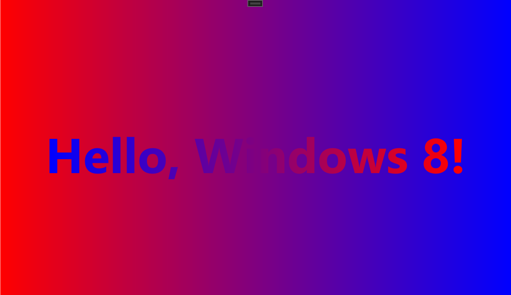

下面让我们看一段标记：

```xml
<Page ...>
	<Grid ...>
    	<TextBlock .../>
        <TextBlock .../>
        <TextBlock .../>
    </Grid>
</Page>
```

通过直接使用 `C#` 代码来创建界面，让我们了解到这些 `TextBlock` 元素会被添加到 `Grid` 的 `Children` 集合中，而 `Grid` 会被设置到 `Page` 的 `Content` 属性。那么 `Children` 和 `Content` 属性如何体现在标记中？

事实上，这些标记是可以显示添加的。属性元素 `Page.Content` 和 `Grid.Children` 允许出现在 `XAML` 文件中。

```xml
<Page ...>
    <Page.Content>
        <Grid ...>
            <Grid.Children>
            	<TextBlock .../>
                <TextBlock .../>
                <TextBlock .../>
            </Grid.Children>
    	</Grid>
    </Page.Content>
</Page>
```

这段标记仍然缺少 `Grid.Children` 属性所需的 `UIElementCollection` 对象。我们不能显示地添加该元素，因为只有定义无参公共构造函数的类才能在 `XAML` 文件中实例化，而 `UIElementCollection` 类缺少这样的构造函数。

这就带来一个问题：`Page.Content` 和 `Grid.Children` 属性元素为何不是 `XAML` 文件强制要求的？

原因很简单。`XAML` 中引用的所有的类允许（且只允许）一个属性是 "内容" 属性。对于这个内容属性，也仅有这个属性，对应的属性元素标签不强制要求。

类中定义的内容属性需要用 `.NET` 属性加以修饰。`Panel` 类（`Grid` 的父类）的定义利用了一个名为 `ContentProperty` 的特性。如果该类是用 `C#` 定义的，那么看起来会像下面这样：

```c#
[ContentProperty(Name="Children")]
public class Panel : FrameworkElement
{
    ...
}
```

这个特性的含义很简单。举例来说，如果遇到下面这样的代码：

```xml
<Grid ...>
	<TextBlock ... />
    <TextBlock ... />
    <TextBlock ... />
</Grid>
```

那么通过 `Grid` 的 `ContentProperty` 特性，`XAML` 解析器便将这些 `TextBlock` 元素添加至 `Children` 属性。

类似地，`UserControl` 类（`Page` 的父类）将 `Content` 属性定义为内容属性：

```c#
[ContentProperty(Name="Content")]
public class UserControl : Control
{
    ...
}
```

我们也可以在自定义的类中使用 `ContentProperty` 特性。为此需要引入 `Windows.UI.Xaml.Markup` 命名空间。

不幸的是，根据 `Windows Runtime` 文档，`ContentProperty` 特性只能修饰类，而不能直接修饰属性。如果文档在未来发生了变化，则通过示例加以学习并保持良好习惯即可。

幸运的是，许多内容属性都是类中最常用的属性。例如 `LinearGradientBrush` 类的内容属性被指定为 `GradientStops`。虽然 `GradientStops` 属性的类型为 `GradientStopCollection` ，但 `XAML` 不强制要求显式设置该集合对象。下面是 `LinearGradientBrush` 的完整声明。

```xml
<TextBlock Text="Hello, Windows 8!"
           FontSize="96">
	<TextBlock.Foreground>
    	<LinearGradientBrush StartPoint="0 0" EndPoint="1 0">
        	<LinearGradientBrush.GradientStops>
            	<GradientStopCollection>
                	<GradientStop Offset="0" Color="Blue" />
                    <GradientStop Offset="1" Color="Red" />
                </GradientStopCollection>
            </LinearGradientBrush.GradientStops>
        </LinearGradientBrush>
    </TextBlock.Foreground>
</TextBlock>
```

其中的 `LinearGradientBrush.GradientStops` 属性和 `GradientStopCollection` 标签都是不必要的，因而可以像下面这样简化。

```xml
<TextBlock Text="Hello, Windows 8!"
           FontSize="96">
	<TextBlock.Foreground>
    	<LinearGradientBrush StartPoint="0 0" EndPoint="1 0">
        	<GradientStop Offset="0" Color="Blue" />
            <GradientStop Offset="1" Color="Red" />
        </LinearGradientBrush>
    </TextBlock.Foreground>
</TextBlock>
```

在保持 `XML` 有效的前提下，标记可以非常简练。下面我们用纯粹的 `XAML` 来重写 `GradientBrushCode` 项目：

```xml
<Page
    x:Class="App2.MainPage"
    xmlns="http://schemas.microsoft.com/winfx/2006/xaml/presentation"
    xmlns:x="http://schemas.microsoft.com/winfx/2006/xaml"
    xmlns:local="using:App2"
    xmlns:d="http://schemas.microsoft.com/expression/blend/2008"
    xmlns:mc="http://schemas.openxmlformats.org/markup-compatibility/2006"
    mc:Ignorable="d"
    Background="{ThemeResource ApplicationPageBackgroundThemeBrush}" Width="1000" Height="600">

    <Grid>
        <Grid.Background>
            <LinearGradientBrush StartPoint="0 0" EndPoint="1 0">
                <GradientStop Offset="0" Color="Red" />
                <GradientStop Offset="1" Color="Blue" />
            </LinearGradientBrush>
        </Grid.Background>

        <TextBlock x:Name="txtblk"
                   Text="Hello, Windows 8!"
                   FontSize="96"
                   FontWeight="Bold"
                   HorizontalAlignment="Center"
                   VerticalAlignment="Center">
            <TextBlock.Foreground>
                <LinearGradientBrush StartPoint="0 0" EndPoint="1 0">
                    <GradientStop Offset="0" Color="Blue" />
                    <GradientStop Offset="1" Color="Red" />
                </LinearGradientBrush>
            </TextBlock.Foreground>
        </TextBlock>
    </Grid>

</Page>
```

运行效果如下：



即便使用属性元素语法，其可读性也要胜过对应的代码。代码方式可以清晰地展示可视树的构建过程，而标记则直观地展现了可视树的结构。

有一点值得注意。假设要为一个带有多个子元素的 `Grid` 定义一个属性元素。

```xml
<Grid>
	<Grid.Background>
    	<SolidColorBrush Color="Blue" />
    </Grid.Background>
    
    <TextBlock Text="one" />
    <TextBlock Text="Two" />
    <TextBlock Text="Three" />
</Grid>
```

可以将属性元素至于底端：

```xml
<Grid>
    <TextBlock Text="one" />
    <TextBlock Text="Two" />
    <TextBlock Text="Three" />
    
    <Grid.Background>
    	<SolidColorBrush Color="Blue" />
    </Grid.Background>
</Grid>
```

但不可以将属性元素混在内容中间：

```xml
<!-- This dosn't work! -->
<Grid>
    <TextBlock Text="one" />
    
    <Grid.Background>
    	<SolidColorBrush Color="Blue" />
    </Grid.Background>
    
    <TextBlock Text="Two" />
    <TextBlock Text="Three" />
</Grid>
```

为什么这样不行呢？我们将 `Children` 属性变成属性元素，答案便不言而喻了。

```xml
<!-- This dosn't work! -->
<Grid>
    <Grid.Children>
    	<TextBlock Text="one" />
    </Grid.Children>
    
    <Grid.Background>
    	<SolidColorBrush Color="Blue" />
    </Grid.Background>
    
    <Grid.Children>
    	<TextBlock Text="Two" />
    	<TextBlock Text="Three" />
    </Grid.Children>
</Grid>
```

`Children` 属性被定义了两次，这显然是不合法的。