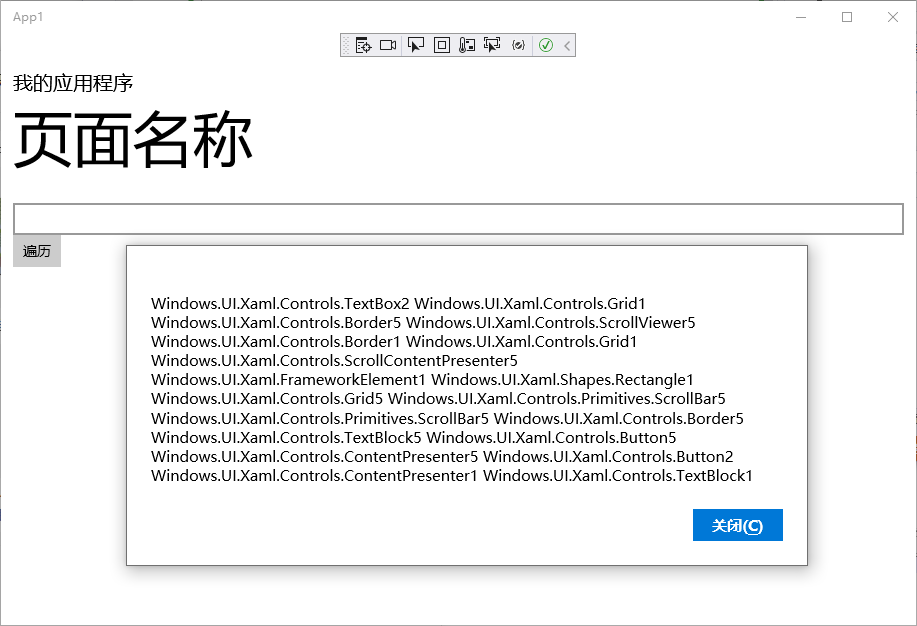

**示例代码：使用 VisualTreeHelper 类来遍历 XAML 元素的可视化树**

**MainPage.xaml**

```xaml
<Page
    x:Class="App1.MainPage"
    xmlns="http://schemas.microsoft.com/winfx/2006/xaml/presentation"
    xmlns:x="http://schemas.microsoft.com/winfx/2006/xaml"
    xmlns:local="using:App1"
    xmlns:d="http://schemas.microsoft.com/expression/blend/2008"
    xmlns:mc="http://schemas.openxmlformats.org/markup-compatibility/2006"
    mc:Ignorable="d"
    Background="{ThemeResource ApplicationPageBackgroundThemeBrush}">

    <Grid Background="{ThemeResource ApplicationPageBackgroundThemeBrush}">
        <Grid.RowDefinitions>
            <RowDefinition Height="Auto"/>
            <RowDefinition Height="*"/>
        </Grid.RowDefinitions>
        <!--TitlePanel 包含应用程序的名称和页标题-->
        <StackPanel x:Name="TitlePanel" Grid.Row="0" Margin="12,35,0,28">
            <TextBlock Text="我的应用程序" FontSize="20"  />
            <TextBlock Text="页面名称" FontSize="60" />
        </StackPanel>

        <!--ContentPanel - 在此处放置其他内容-->
        <Grid x:Name="ContentPanel" Grid.Row="1" Margin="12,0,12,0">
            <StackPanel x:Name="stackPanel">
                <TextBox ></TextBox>
                <Button Content="遍历" Click="Button_Click_1"></Button>
            </StackPanel>
        </Grid>
    </Grid>
    
</Page>
```

**MainPage.xaml.cs**

```c#
using System;
using System.Collections.Generic;
using System.IO;
using System.Linq;
using System.Runtime.InteropServices.WindowsRuntime;
using Windows.Foundation;
using Windows.Foundation.Collections;
using Windows.UI.Popups;
using Windows.UI.Xaml;
using Windows.UI.Xaml.Controls;
using Windows.UI.Xaml.Controls.Primitives;
using Windows.UI.Xaml.Data;
using Windows.UI.Xaml.Input;
using Windows.UI.Xaml.Media;
using Windows.UI.Xaml.Navigation;

// https://go.microsoft.com/fwlink/?LinkId=402352&clcid=0x804 上介绍了“空白页”项模板

namespace App1
{
    /// <summary>
    /// 可用于自身或导航至 Frame 内部的空白页。
    /// </summary>
    public sealed partial class MainPage : Page
    {
        string visulTreeStr = "";

        public MainPage()
        {
            this.InitializeComponent();
        }

        // 单击事件，弹出 XAML 页面里面 StackPanel 控件的可视化树的所有对象
        private async void Button_Click_1(object sender, RoutedEventArgs e)
        {
            visulTreeStr = "";
            GetChildType(stackPanel);
            MessageDialog messageDialog = new MessageDialog(visulTreeStr);
            await messageDialog.ShowAsync();
        }

        // 获取某个 XAML 元素的可视化对象的递归方法
        public void GetChildType(DependencyObject reference)
        {
            // 获取子对象的个数
            int count = VisualTreeHelper.GetChildrenCount(reference);
            // 如果子对象的个数不为 0 将继续递归调用
            if (count > 0)
            {
                for (int i = 0; i <= VisualTreeHelper.GetChildrenCount(reference) - 1; i++)
                {
                    // 获取当前节点的子对象
                    var child = VisualTreeHelper.GetChild(reference, i);
                    // 获取子对象的类型
                    visulTreeStr += child.GetType().ToString() + count + " ";
                    // 递归调用 
                    GetChildType(child);
                }
            }
        }
    }
}
```

运行效果如下：



