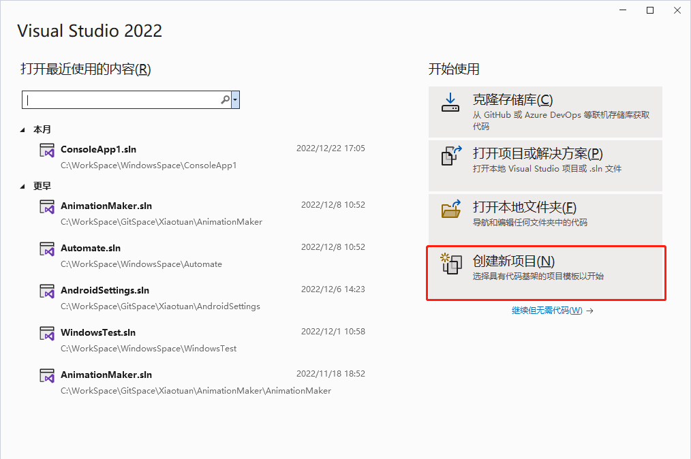
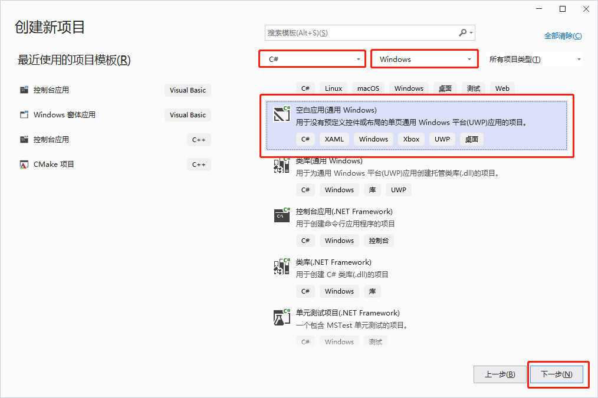
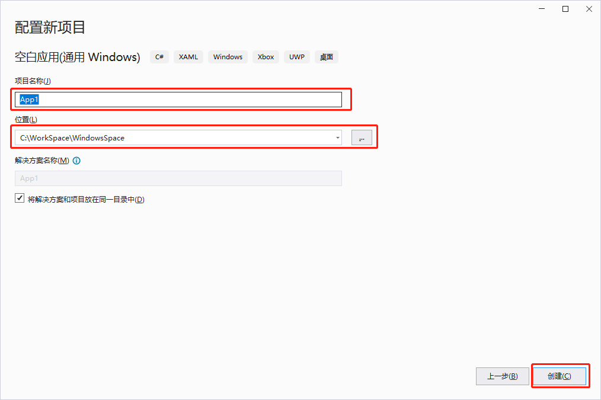
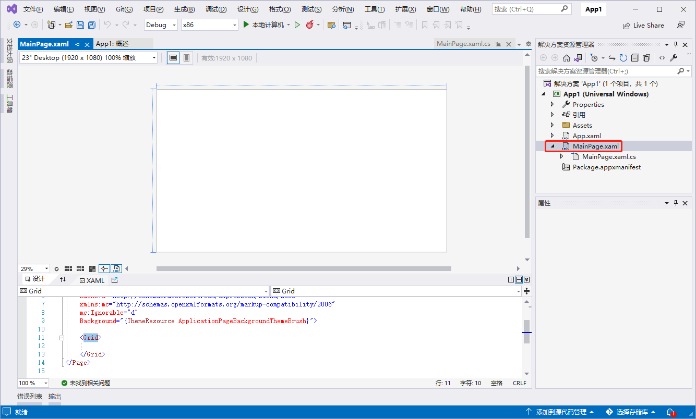
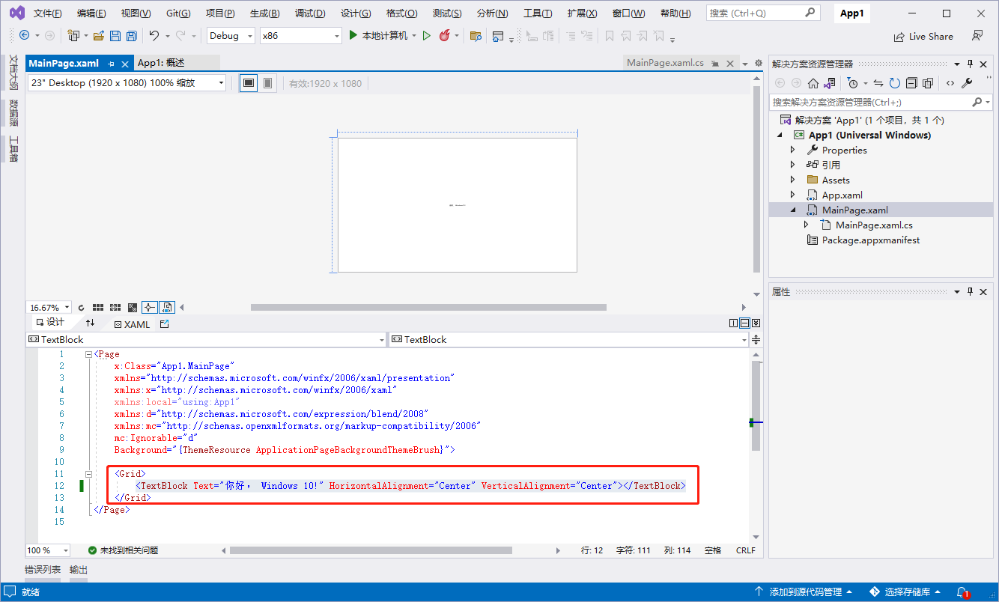
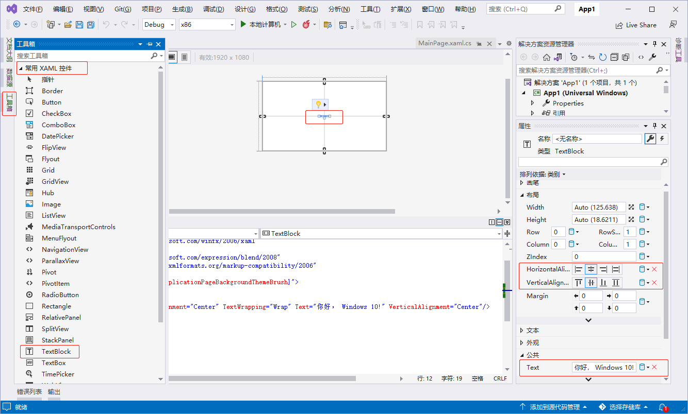
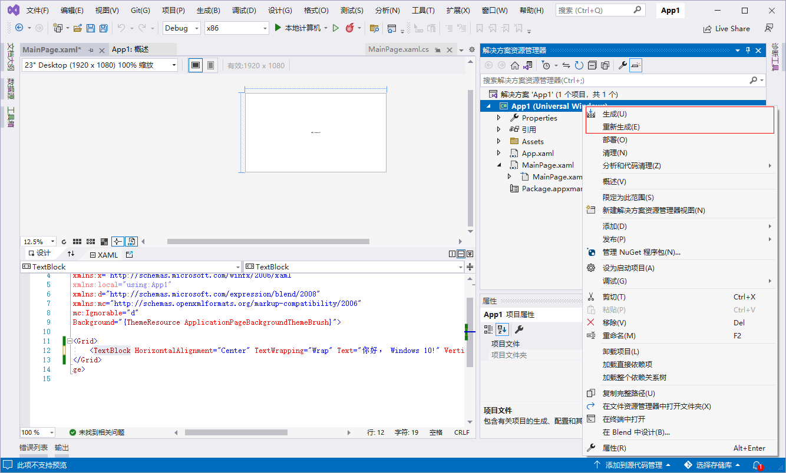

[toc]

### 1. 新建一个 Windows 的通用应用程序

1. 打开 `Visual Studio` 开发工具，选择 `创建新项目(N)` 菜单（或者选择 `File` 菜单，选择新建一个工程（New Project）。

   

2. 在 `New Project` 对话框中选择 `Templates` -> `Visual C#` -> `Windows` -> `Universal`（`空白应用(通用 Windows)`），单击 `下一步` 按钮。

   

3. 在 `配置新项目` 对话框中，修改项目名称和位置，然后单击 `创建` 按钮完成项目的创建。

   

### 2. 编写代码

1. 在 `解决方案资源管理器` 中双击 `MainPage.xaml` 文件。

   

2. 在 `Grid` 控件里面添加一个 `TextBlock` 控件，代码如下所示：

   ```xml
   <TextBlock Text="你好， Windows 10!" HorizontalAlignment="Center" VerticalAlignment="Center"></TextBlock>
   ```

   

   也可以通过可视化的编程界面来实现，单击 `Visual Studio` 左边的工具箱，把 `TextBlock` 控件拖放到可视化编辑界面，然后选中 `TextBlock` 控件，单击右边的属性窗口，在属性窗口可以对 `Text`、`HorizontalAlignment` 和 `VerticalAlignment` 属性进行设置。

   

### 3. 编译和部署程序

右键解决方案名称，选择 `Build` 或者 `Rebuild` 选项，表示构建或者重构解决方案。



### 