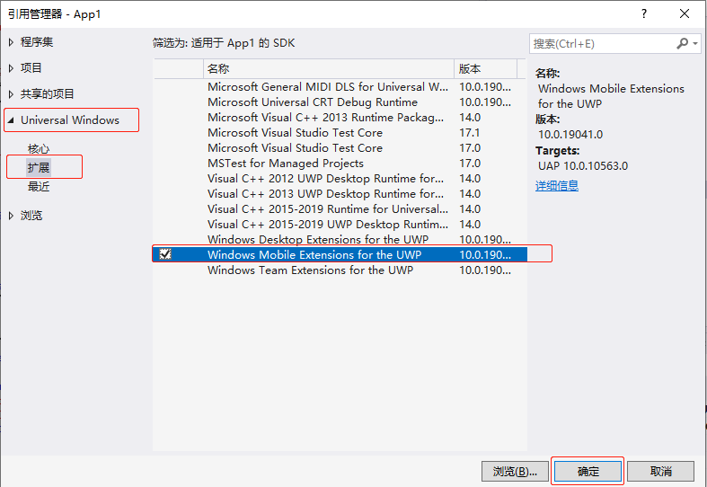
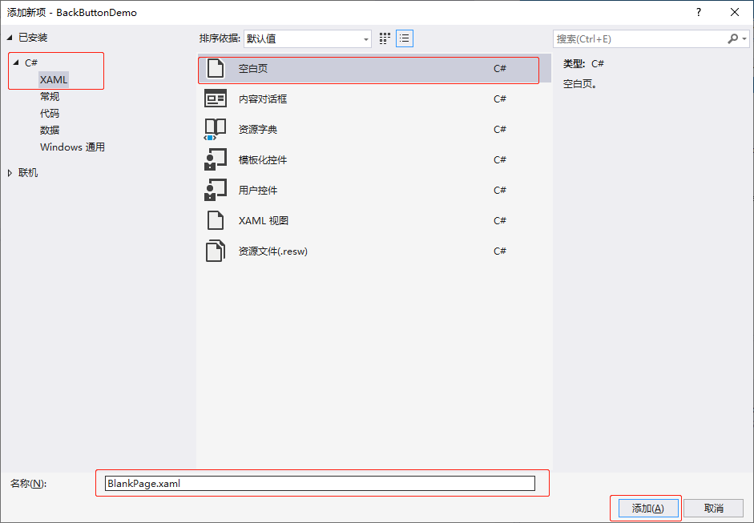

[toc]

目前在 Windows 10 里面有 Windows Mobile Extension SDK 和 Windows Desktop Extension SDK 两个扩展的 SDK 分别表示手机版本和桌面版本的扩展 SDK。这两个 SDK 都是直接内置在 Windows 10 的开发 SDK 里面的，但是默认情况下不会给项目工程添加上，需要使用时可以在项目工程里面引用，路径为 `Project` -> `Add Reference` -> `Windows Universa` -> `Extensions`。在使用特定平台的 API 的时候，必须判断当前的环境是否支持。

### 1. 示例程序

首先创建一个 `Windows 10` 的通用应用程序项目，命名为 `BackButtonDemo`，在项目里面引用 `Windows Mobile Extension SDK，如下图所示：



#### 1.1 App.xaml.cs 文件代码

```csharp
using System;
using System.Collections.Generic;
using System.IO;
using System.Linq;
using System.Runtime.InteropServices.WindowsRuntime;
using Windows.ApplicationModel;
using Windows.ApplicationModel.Activation;
using Windows.Foundation;
using Windows.Foundation.Collections;
using Windows.UI.Xaml;
using Windows.UI.Xaml.Controls;
using Windows.UI.Xaml.Controls.Primitives;
using Windows.UI.Xaml.Data;
using Windows.UI.Xaml.Input;
using Windows.UI.Xaml.Media;
using Windows.UI.Xaml.Navigation;

namespace BackButtonDemo
{
    /// <summary>
    /// 提供特定于应用程序的行为，以补充默认的应用程序类。
    /// </summary>
    sealed partial class App : Application
    {
        // 是否支持硬件后退键的标识
        public static bool IsHardwareButtonsAPIPresent;

        /// <summary>
        /// 初始化单一实例应用程序对象。这是执行的创作代码的第一行，
        /// 已执行，逻辑上等同于 main() 或 WinMain()。
        /// </summary>
        public App()
        {
            this.InitializeComponent();
            this.Suspending += OnSuspending;
            // 判断当前是否支持硬件后退键
            IsHardwareButtonsAPIPresent = Windows.Foundation.Metadata.ApiInformation.IsTypePresent("Windows.Phone.UI.Input.HardwareButtons");
            if (IsHardwareButtonsAPIPresent)
            {
                // 添加后退键事件
                Windows.Phone.UI.Input.HardwareButtons.BackPressed += HardwareButtons_BackPressed;
            }
        }

        /// <summary>
        /// 在应用程序由最终用户正常启动时进行调用。
        /// 将在启动应用程序以打开特定文件等情况下使用。
        /// </summary>
        /// <param name="e">有关启动请求和过程的详细信息。</param>
        protected override void OnLaunched(LaunchActivatedEventArgs e)
        {
            Frame rootFrame = Window.Current.Content as Frame;

            // 不要在窗口已包含内容时重复应用程序初始化，
            // 只需确保窗口处于活动状态
            if (rootFrame == null)
            {
                // 创建要充当导航上下文的框架，并导航到第一页
                rootFrame = new Frame();

                rootFrame.NavigationFailed += OnNavigationFailed;

                if (e.PreviousExecutionState == ApplicationExecutionState.Terminated)
                {
                    //TODO: 从之前挂起的应用程序加载状态
                }

                // 将框架放在当前窗口中
                Window.Current.Content = rootFrame;
            }

            if (e.PrelaunchActivated == false)
            {
                if (rootFrame.Content == null)
                {
                    // 当导航堆栈尚未还原时，导航到第一页，
                    // 并通过将所需信息作为导航参数传入来配置
                    // 参数
                    rootFrame.Navigate(typeof(MainPage), e.Arguments);
                }
                // 确保当前窗口处于活动状态
                Window.Current.Activate();
            }
        }

        /// <summary>
        /// 导航到特定页失败时调用
        /// </summary>
        ///<param name="sender">导航失败的框架</param>
        ///<param name="e">有关导航失败的详细信息</param>
        void OnNavigationFailed(object sender, NavigationFailedEventArgs e)
        {
            throw new Exception("Failed to load Page " + e.SourcePageType.FullName);
        }

        /// <summary>
        /// 在将要挂起应用程序执行时调用。  在不知道应用程序
        /// 无需知道应用程序会被终止还是会恢复，
        /// 并让内存内容保持不变。
        /// </summary>
        /// <param name="sender">挂起的请求的源。</param>
        /// <param name="e">有关挂起请求的详细信息。</param>
        private void OnSuspending(object sender, SuspendingEventArgs e)
        {
            var deferral = e.SuspendingOperation.GetDeferral();
            //TODO: 保存应用程序状态并停止任何后台活动
            deferral.Complete();
        }

        // 后退键事件，如果可以返回上一个页面则返回上一个页面
        private void HardwareButtons_BackPressed(object sender, Windows.Phone.UI.Input.BackPressedEventArgs e)
        {
            Frame frame = Window.Current.Content as Frame;
            if (frame == null)
            {
                return;
            }
            if (frame.CanGoBack)
            {
                frame.GoBack();
                e.Handled = true;
            }
        }
    }
}
```

#### 1.2 BlankPage.xaml 文件代码

在项目中添加一个新的 XAML 页面 `BlankPage.xaml` ，如下图所示，在页面中增加顶部的后退按钮和隐藏显示逻辑。



```xml
<Page
    x:Class="BackButtonDemo.BlankPage"
    xmlns="http://schemas.microsoft.com/winfx/2006/xaml/presentation"
    xmlns:x="http://schemas.microsoft.com/winfx/2006/xaml"
    xmlns:local="using:BackButtonDemo"
    xmlns:d="http://schemas.microsoft.com/expression/blend/2008"
    xmlns:mc="http://schemas.openxmlformats.org/markup-compatibility/2006"
    mc:Ignorable="d"
    Background="{ThemeResource ApplicationPageBackgroundThemeBrush}">

    <Grid>
        <StackPanel VerticalAlignment="Top" Orientation="Horizontal">
            <Button x:Name="backButton" Margin="24, 24, 24, 24" Click="backButton_Click" Style="{StaticResource NavigationBackButtonNormalStyle}" />
            <TextBlock Text="你好" FontSize="30" HorizontalAlignment="Left" VerticalAlignment="Center"></TextBlock>
        </StackPanel>
    </Grid>
</Page>
```

#### 1.3 BlankPage.xaml.cs 文件代码

```csharp
using System;
using System.Collections.Generic;
using System.IO;
using System.Linq;
using System.Runtime.InteropServices.WindowsRuntime;
using Windows.Foundation;
using Windows.Foundation.Collections;
using Windows.UI.Xaml;
using Windows.UI.Xaml.Controls;
using Windows.UI.Xaml.Controls.Primitives;
using Windows.UI.Xaml.Data;
using Windows.UI.Xaml.Input;
using Windows.UI.Xaml.Media;
using Windows.UI.Xaml.Navigation;

// https://go.microsoft.com/fwlink/?LinkId=234238 上介绍了“空白页”项模板

namespace BackButtonDemo
{
    /// <summary>
    /// 可用于自身或导航至 Frame 内部的空白页。
    /// </summary>
    public sealed partial class BlankPage : Page
    {
        public BlankPage()
        {
            this.InitializeComponent();
            if (App.IsHardwareButtonsAPIPresent)
            {
                backButton.Visibility = Visibility.Collapsed;
            }
            else
            {
                backButton.Visibility = Visibility.Visible;
            }
        }

        // 后退按钮处理
        private void backButton_Click(object sender, RoutedEventArgs e)
        {
            if (this.Frame.CanGoBack)
            {
                // 返回上一个页面
                this.Frame.GoBack();
            }
        }
    }
}
```

#### 1.4 MainPage.xaml 文件代码

```xml
<Page
    x:Class="BackButtonDemo.MainPage"
    xmlns="http://schemas.microsoft.com/winfx/2006/xaml/presentation"
    xmlns:x="http://schemas.microsoft.com/winfx/2006/xaml"
    xmlns:local="using:BackButtonDemo"
    xmlns:d="http://schemas.microsoft.com/expression/blend/2008"
    xmlns:mc="http://schemas.openxmlformats.org/markup-compatibility/2006"
    mc:Ignorable="d"
    Background="{ThemeResource ApplicationPageBackgroundThemeBrush}">

    <Grid>
        <Button Content="跳转到新的页面" Click="Button_Click" VerticalAlignment="Center" HorizontalAlignment="Center"></Button>
    </Grid>
</Page>
```

#### 1.5 MainPage.xaml.cs 文件代码

```csharp
using System;
using System.Collections.Generic;
using System.IO;
using System.Linq;
using System.Runtime.InteropServices.WindowsRuntime;
using Windows.Foundation;
using Windows.Foundation.Collections;
using Windows.UI.Xaml;
using Windows.UI.Xaml.Controls;
using Windows.UI.Xaml.Controls.Primitives;
using Windows.UI.Xaml.Data;
using Windows.UI.Xaml.Input;
using Windows.UI.Xaml.Media;
using Windows.UI.Xaml.Navigation;

// https://go.microsoft.com/fwlink/?LinkId=402352&clcid=0x804 上介绍了“空白页”项模板

namespace BackButtonDemo
{
    /// <summary>
    /// 可用于自身或导航至 Frame 内部的空白页。
    /// </summary>
    public sealed partial class MainPage : Page
    {
        public MainPage()
        {
            this.InitializeComponent();
        }

        private void Button_Click(object sender, RoutedEventArgs e)
        {
            // 从 MainPage 页面跳转到 BlankPage1 页面
            this.Frame.Navigate(typeof(BlankPage));
        }
    }
}
```

