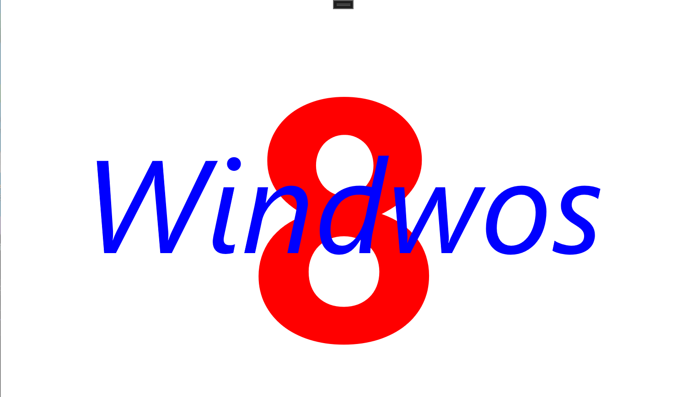

`Grid` 支持多个子 `TextBlock`，像下面代码在 `Grid` 中添加了两个颜色和字体大小各不同的两个 `TextBlock` 元素：

```xml
<Grid Name="contentGrid">
    <TextBlock Text="8"
               FontSize="500"
               FontWeight="Bold"
               Foreground="Red"
               HorizontalAlignment="Center"
               VerticalAlignment="Center" />

    <TextBlock Text="Windwos"
               FontSize="192"
               FontStyle="Italic"
               Foreground="Blue"
               HorizontalAlignment="Center"
               VerticalAlignment="Center" />
</Grid>
```

运行效果如下：



`Grid` 单元格中可以通过 `HorizontalAlignment` 和 `VerticalAlignment` 组织多个元素以防止元素重叠：

```xml
<Grid Name="contentGrid">
    <!-- Chinese (simplified) -->
    <TextBlock Text="你好，世界"
               HorizontalAlignment="Left"
               VerticalAlignment="Top" />

    <!-- Urdu -->
    <TextBlock Text="ہیلو دنیا،"
               HorizontalAlignment="Center"
               VerticalAlignment="Top" />


    <!-- Japanese -->
    <TextBlock Text="こんにちは、世界中のみなさん"
               HorizontalAlignment="Right"
               VerticalAlignment="Top" />

    <!-- Hebrew -->
    <TextBlock Text="שלום, עולם"
               HorizontalAlignment="Left"
               VerticalAlignment="Center" />

    <!-- Esperanto -->
    <TextBlock Text="Saluton, mondo"
               HorizontalAlignment="Center"
               VerticalAlignment="Center" />

    <!-- Arabic -->
    <TextBlock Text="مرحبا، العالم"
               HorizontalAlignment="Right"
               VerticalAlignment="Center" />

    <!-- Korean -->
    <TextBlock Text="안녕하세요, 전 세계"
               HorizontalAlignment="Left"
               VerticalAlignment="Bottom" />

    <!-- Russian -->
    <TextBlock Text="Здравствуй, мир"
               HorizontalAlignment="Center"
               VerticalAlignment="Bottom" />

    <!-- Hindi -->
    <TextBlock Text="नमस्ते दुनिया है,"
               HorizontalAlignment="Right"
               VerticalAlignment="Bottom" />
</Grid>
```

