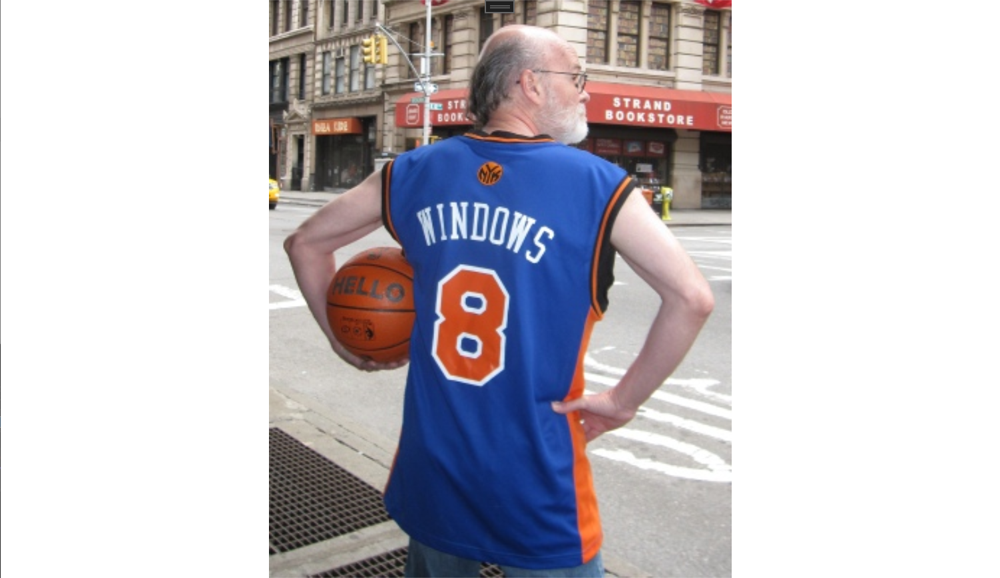
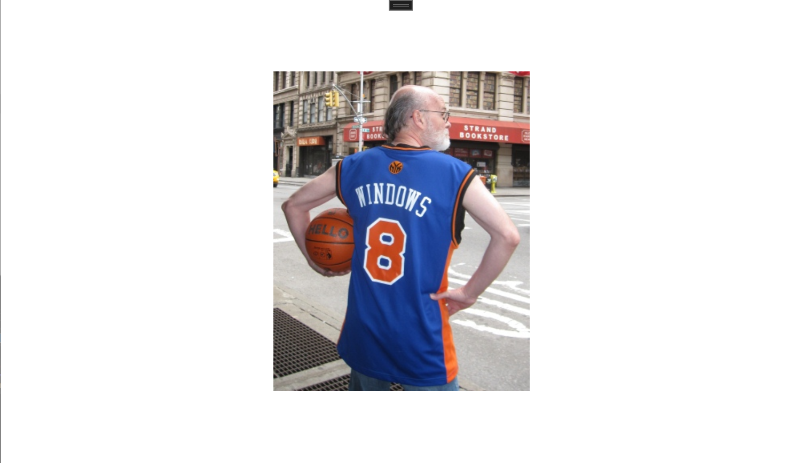

在 `XAML` 文件中添加 `Image` 控件：

```xml
<Page
    x:Class="App2.MainPage"
    xmlns="http://schemas.microsoft.com/winfx/2006/xaml/presentation"
    xmlns:x="http://schemas.microsoft.com/winfx/2006/xaml"
    xmlns:local="using:App2"
    xmlns:d="http://schemas.microsoft.com/expression/blend/2008"
    xmlns:mc="http://schemas.openxmlformats.org/markup-compatibility/2006"
    mc:Ignorable="d"
    Background="{ThemeResource ApplicationPageBackgroundThemeBrush}">

    <Grid Name="contentGrid">
        <Image Source="http://www.charlespetzold.com/pw6/PetzoldJersey.jpg" />
    </Grid>

</Page>
```

在默认情况下，图片会被缩放以适应可用空间，但会保持图片的原始长宽比。



我们可以通过 `Image` 类定义的 `Stretch` 属性来修改这个默认的显示方式。该属性的默认值为枚举成员 `Stretch.Uniform`。下面我们尝试将其设置为 `Fill`：

```xml
<Grid Name="contentGrid">
    <Image Source="http://www.charlespetzold.com/pw6/PetzoldJersey.jpg"
           Stretch="Fill"/>
</Grid>
```


将 `Stretch` 属性设置为 `None`，则会按原像素值（320x400）显示图片，如下图所示：



`UniformToFill` 属性可使图片在保持长宽比不变的前提下充满整个容器。但为了做到这一点，只有一个办法，即对图片进行裁剪。至于哪一部分被裁剪，则取决于 `HorizontalAlignment` 和 `VerticalAlignment` 属性的设置。