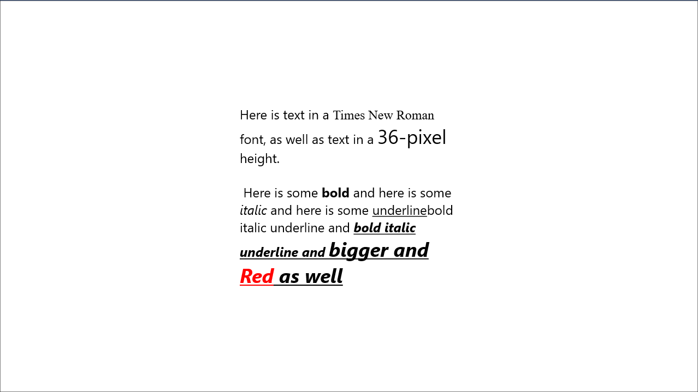

`TextBlock` 的内容属性并非 `Text` 属性，而是一个名为 `Inlines` 的属性，其类型为 `InlineCollection`。该类型可以包含若干 `Inline` 对象，确切地讲是 `Inline` 子类的实例。`Inline` 类及其子类定义于 `Windows.UI.Xaml.Documents`  命名空间下。

```
Object
	DependencyObject
		TextElement
			Block
				Paragraph
			Inline
				InlineUIContainer
				LineBreak
				Run（用于定义 Text 属性）
				Span（用于定义 Inlines 属性）
					Bold
					Italic
					Underline
```

`TextElement` 定义了 `Foreground` 和所有与字体相关的属性：`FontFamily`、`FontSize`、`FontWeight`（用于设置字体粗细）、`FontStretch`（能够为支持的字体设置伸缩）和 `CharacterSpacing`。这些属性被所有子类继承。

`Block` 和 `Paragraph` 类主要供 `RichTextBlock` 类使用，后者是 `TextBlock` 的升级版本。

`Run` 元素是唯一定义了 `Text` 属性的类，而该属性恰好也是内容属性。`InlineCollection` 中的文本内容都会被转换为 `Run` 对象，除非这些内容已经是 `Run` 对象。我们也可以显示地用 `Run` 对象来指定文本字符串的各种字体属性。

与 `TextBlock` 一样，`Span` 类也定义了 `Inlines` 属性，因而 `Span` 及其子类可以嵌套。`Span` 的 3 个子类均是某种快捷方式。例如，`Bold` 类等价于将 `Span` 的 `FontWeight` 特性设置为 `Bold`。

下面我们来分析一个具体例子。这段标记定义了一个 `TextBlock` 元素，在 `Inlines` 集合中添加几个嵌套的快捷方式类：

```xaml
<TextBlock>
    Text in <Bold>bold</Bold> and <Italic>italic</Italic> and
    <Bold><Italic>bold italic</Italic></Bold>
</TextBlock>
```

在解析这段标记时，每段零散的文本都会被转换为一个 `Run` 对象。那么这个 `TextBlock` 的 `Inlines` 集合便有 6 个对象，它们的类型依次为 `Run`、`Bold`、`Run`、`Italic`、`Run` 和 `Bold`。

下面这个示例定义了一个略微有些复杂的 `TextBlock` 元素，展示了更多格式化功能：

```xml
<Grid>
    <TextBlock Width="400"
               FontSize="24"
               TextWrapping="Wrap"
               HorizontalAlignment="Center"
               VerticalAlignment="Center">
        Here is text in a 
        <Run FontFamily="Times New Roman">Times New Roman</Run> font,
        as well as text in a
        <Run FontSize="36">36-pixel</Run> height.
        <LineBreak />
        <LineBreak />
        Here is some <Bold>bold</Bold> and here is some
        <Italic>italic</Italic> and here is some
        <Underline>underline</Underline>bold italic underline and
        <Bold><Italic><Underline>bold italic underline and
        <Span FontSize="36">bigger and
        <Span Foreground="Red">Red</Span> as well</Span>
        </Underline></Italic></Bold>
    </TextBlock>
</Grid>
```

