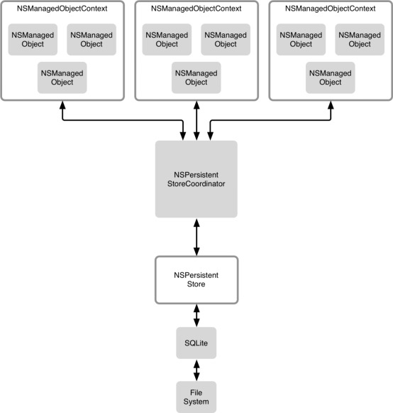

# CoreData多线程

##1. NSManagedObjectContext并发队列类型

在 `CoreData` 中 `NSManagedObjectContext` 是支持多线程的，可以在创建 `NSManagedObjectContext` 对象时，指定其并发队列的类型。当指定队列类型后，系统会将操作都放在指定的队列中执行，如果指定的是私有队列，系统会创建一个新的队列。但这都是**系统内部的行为**，我们并**不能获取这个队列**，队列由系统所拥有，**并由系统将任务派发到这个队列中执行的**。

**NSManagedObjectContext并发队列类型：**

+ **NSConfinementConcurrencyType：**如果使用 `init` 方法初始化上下文，默认就是这个并发类型。这个枚举值是**不支持多线程的**，从名字上也体现出来了。
+ **NSPrivateQueueConcurrencyType：**私有并发队列类型，操作都是在子线程中完成的。
+ **NSMainQueueConcurrencyType：**主并发队列类型，如果涉及到 `UI`相关的操作，应该考虑使用这个枚举值初始化上下文。

##2. NSManagedObjectContext多线程调用方式

在 `CoreDat` 中**NSManagedObjectContext不是线程安全的**，在多线程情况下使用 `NSManagedObjectContext` 时，不能简单的将 `NSManagedObjectContext` 从一个线程传递到另一个线程中使用，这并不是 `CoreData` 的多线程，而且会出现问题。对于 `NSManagedObjectContext` 多线程的使用，苹果给出了自己的解决方案。

在创建的 `NSManagedObjectContext` 中使用多线程，无论是私有队列还是主队列，都应该采用下面两种多线程的使用方式，**而不是自己手动创建线程**。调用下面方法后，系统内部会将任务派发到不同的队列中执行。可以在不同的线程中调用 `NSManagedObjectContext` 的这两个方法，这个是允许的。

```Objective-C
- (void)performBlock:(void (^)())block				异步执行的block，调用之后会立刻返回。
- (void)performBlockAndWait:(void (^)())block	同步执行的block，调用之后会等待这个任务完成，才会继续向下执行。
```

下面是多线程调用的示例代码，在多线程的环境下执行 `NSManagedObjectContext` 的 `save` 方法，就是将 `save` 方法放在 `NSManagedObjectContext` 的`block` 体重异步执行，其他方法的调用也是一样的。

```Objective-C
[context performBlock:^{
	[context save:nil];
}];
```

##3. 多线程的使用

在业务比较复杂的情况下，需要进行大量数据处理，并且还需要涉及到 `UI` 的操作。对于这种复杂需求，如果都放在主队列中，**对性能和界面流畅度都会有很大的影响**，导致用户体验非常差，降低屏幕 `FPS`。对于这种情况，可以采取多个 `NSManagedObjectContext` 配合的方式。

`CoreData` 多线程的发展中，在 `iOS5` 经历了一次比较大的变化，之后可以更方便的使用多线程。从 `iOS5` 开始，支持设置 `NSManagedObjectContext` 的 `parentContext` 属性，通过这个属性可以设置 `NSManagedObjectContext` 的父 `NSManagedObjectContext`。下面会针对 `iOS5` 之前和之后，分别讲解 `CoreData` 的多线程使用。

尽管现在的开发中早就不兼容 `iOS5` 之前的系统了，但是作为了解这里还是要讲一下，而且这种同步方法在 `iOS5` 之后也是可以正常使用的，也有很多人还在使用这种同步方式，下面其他章节也是同理。

##4. iOS5之前使用多个NSManagedObjectContext

在 `iOS5` 之前实现 `NSManagedObjectContext` 的多线程，可以创建多个 `NSManagedObjectContext`，多个 `NSManagedObjectContext` 使用同一个 `NSPersistentStoreCoordinator`，并让多个 `NSManagedObjectContext` 实现数据同步。通过这种方式不用担心`NSPersistentStoreCoordinator` 在调用过程中的线程问题， `NSManagedObjectContext` 在使用 `NSPersistentStoreCoordinator` 进行 `save`操作时，会对 `NSPersistentStoreCoordinator` 进行**加锁**，等当前加锁的 `NSManagedObjectContext` 执行完成操作之后，其他 `NSManagedObjectContext`  才能继续执行操作。

每一个 `NSPersistentStoreCoordinator` 都对应着一个持久化存储区，`NSPersistentStoreCoordinator` 知道存储区中数据存储的数据结构，而 `NSManagedObjectContext` 需要使用这个 `NSPersistentStoreCoordinator` 进行 `save` 操作的实现。



这样做有一个问题，当一个 `NSManagedObjectContext` 发生改变并持久化到本地时，系统并不会将其他 `NSManagedObjectContext` 缓存在内存中的 `NSManagedObject` 对象改变。所以这就需要我们在 `NSManagedObjectContext` 发生改变是，将其他 `NSManagedObjectContext` 数据更新。

根据上面的解释，在下面例子中创建了一个主队列的 `Main NSManagedObjectContext`，主要用于 `UI` 操作。一个私有队列的 `background NSManagedObjectContext`，用于除 `UI` 之外的耗时操作，两个 `NSManagedObjectContext` 使用的同一个 `NSPersistentStoreCoordinator`。

```Objective-C
// 获取NSPersistentStoreCoordinator实例对象
- (NSPersistentStoreCoordinator *)persistentStoreCoordinator {
    // 创建托管对象模型，并指明加载Company模型文件
    NSURL *modelPath = [[NSBundle mainBundle] URLForResource:@"Company" withExtension:@"momd"];
    if (@available(iOS 11.0, *)) {} else {
        modelPath = [modelPath URLByAppendingPathComponent:@"Company.mom"];
    }
    NSManagedObjectModel *model = [[NSManagedObjectModel alloc] initWithContentsOfURL:modelPath];

    // 创建NSPersistentStoreCoordinator对象，并将托管对象模型当做参数传入，其他NSManagedObjectContext都是用这一个NSPersistentStoreCoordinator。
    NSPersistentStoreCoordinator *PSC = [[NSPersistentStoreCoordinator alloc] initWithManagedObjectModel:model];

    // 根据指定的路径，创建并关联本地数据库
    NSString *dataPath = NSSearchPathForDirectoriesInDomains(NSDocumentDirectory, NSUserDomainMask, YES).lastObject;
    dataPath = [dataPath stringByAppendingFormat:@"/%@.sqlite", @"Company"];
    [PSC addPersistentStoreWithType:NSSQLiteStoreType configuration:nil URL:[NSURL fileURLWithPath:dataPath] options:nil error:nil];

    return PSC;
}

// 初始化用于本地存储的所有NSManagedObjectContext
- (void)createManagedObjectContext {
    // 创建NSPersistentStoreCoordinator实例对象，其他NSManagedObjectContext都用这一个NSPersistentStoreCoordinator
    NSPersistentStoreCoordinator *PSC = self.persistentStoreCoordinator;
    
    // 创建主队列NSManagedObjectContext，用于执行UI操作
    NSManagedObjectContext *mainMOC = [[NSManagedObjectContext alloc] initWithConcurrencyType:NSMainQueueConcurrencyType];
    mainMOC.persistentStoreCoordinator = PSC;
    
    // 创建私有队列NSManagedObjectContext，用于执行其他耗时操作
    NSManagedObjectContext *backgroundMOC = [[NSManagedObjectContext alloc] initWithConcurrencyType:NSPrivateQueueConcurrencyType];
    backgroundMOC.persistentStoreCoordinator = PSC;
    
    // 通过监听NSManagedObjectContextDidSaveNotification通知，来获取所有NSManagedObjectContext的改变消息
    [[NSNotificationCenter defaultCenter] addObserver:self selector:@selector(contextChanged:) name:NSManagedObjectContextDidSaveNotification object:nil];
}

// MOC改变后的通知回调
- (void)contextChanged:(NSNotification *)noti {
    NSManagedObjectContext *MOC = noti.object;
    // 这里需要做判断操作，判断当前改变的NSManagedObjectContext是否我们将要做同步的NSManagedObjectContext，如果就是当前NSManagedObjectContext自己做的改变，那就不需要再同步自己了。
    // 由于项目中可能存在多个NSPersistentStoreCoordinator，所以下面还需要判断NSPersistentStoreCoordinator是否当前操作的NSPersistentStoreCoordinator，如果不是当前NSPersistentStoreCoordinator则不需要同步，不要去同步其他本地存储的数据。
    [MOC performBlock:^{
        // 直接调用系统提供的同步API，系统内部会完成同步的实现细节。
        [MOC mergeChangesFromContextDidSaveNotification:noti];
    }];
}
```

在上面的 `Demo` 中，创建了一个 `NSPersistentStoreCoordinator`，并将其他 `NSManagedObjectContext` 都关联到这个 `NSPersistentStoreCoordinator` 上，这样所有的 `NSManagedObjectContext` 执行本地持久化相关的操作时，都是通过同一个 `NSPersistentStoreCoordinator` 进行操作的。并在下面添加了一个通知，这个通知是监听所有 `NSManagedObjectContext` 执行 `save` 操作后的通知，并在通知的回调方法中**进行数据的合并**。

##5. iOS之后使用多个NSManagedObjectContext

在 `iOS5` 之后，`NSManagedObjectContext` 可以设置 `parentContext`，一个`parentContext` 可以拥有多个 `ChildContext`。在 `ChildContext` 执行 `save` 操作后，会将操作 `push` 到 `parentContext`，由 `parentContext` 去完成真正的 `save` 操作，而 `ChildContext` 所有的改变都会被 `parentContext` 所知晓，这解决了之前 `NSManagedObjectContext` 手动同步数据的问题。

需要注意的是，在 `ChildContext` 调用 `save` 方法之后，此时并没有将数据写入存储区，还需要调用 `parentContext` 的 `save` 方法。因为 `ChildContext` 并不拥有 `NSPersistentStoreCoordinator` ，`ChildContext` 也不需要设置 `NSPersistentStoreCoordinator` ，所以需要 `parentContext` 调用 `NSPersistentStoreCoordinator` 来执行真正的 `save` 操作。也就是只有拥有 `NSPersistentStoreCoordinator` 的 `NSManagedObjectContext` 执行 `save` 操作后，才是真正的执行了写入存储区的操作。

```Objective-C
- (void)createManagedObjectContext {
    // 创建NSPersistentStoreCoordinator实例对象，还是用上面Demo的实例化代码
    NSPersistentStoreCoordinator *PSC = self.persistentStoreCoordinator;
    
    // 创建主队列NSManagedObjectContext，用于执行UI操作
    NSManagedObjectContext *mainMOC = [[NSManagedObjectContext alloc] initWithConcurrencyType:NSMainQueueConcurrencyType];
    mainMOC.persistentStoreCoordinator = PSC;
    
    // 创建私有队列MOC，用于执行其他耗时操作，backgroundMOC并不需要设置PSC
    NSManagedObjectContext *backgroundMOC = [[NSManagedObjectContext alloc] initWithConcurrencyType:NSPrivateQueueConcurrencyType];
    backgroundMOC.parentContext = mainMOC;
    
    // 私有队列的NSManagedObjectContext和主队列的NSManagedObjectContext，在执行save操作时，都应该调用performBlock:方法，在自己的队列中执行save操作。
    // 私有队列的NSManagedObjectContext执行完自己的save操作后，还调用了主队列NSManagedObjectContext的save方法，来完成真正的持久化操作，否则不能持久化到本地
    [backgroundMOC performBlock:^{
        [backgroundMOC save:nil];
        [mainMOC performBlock:^{
            [mainMOC save:nil];
        }];
    }];
}
```