[toc]
# 手动向项目中添加CoreData

使用`CoreData`的第一步是创建后缀为`.xcdatamodeld`的模型文件，使用快捷键<kbd>Command</kbd> + <kbd>N</kbd>，选择`Core Data -> Data Model -> Next`，完成模型文件的创建。

##1. 添加实体

现在可以通过长按左侧列表下方的`Add Entity`按钮，会弹出`Add Entity`、`Add Fetch Index`、`Add Fetch Request`、`Add Configuration`选项，可以添加实体、索引模板、请求模板、配置信息。这里先选择`Add Entity`来添加一个实体，命名为Person。

添加`Person`实体后，会发现一个实体对应着三部分内容，`Attributes`、`RelationShips`、`Fetched Properties`，分别对应着属性、关联关系、获取操作。

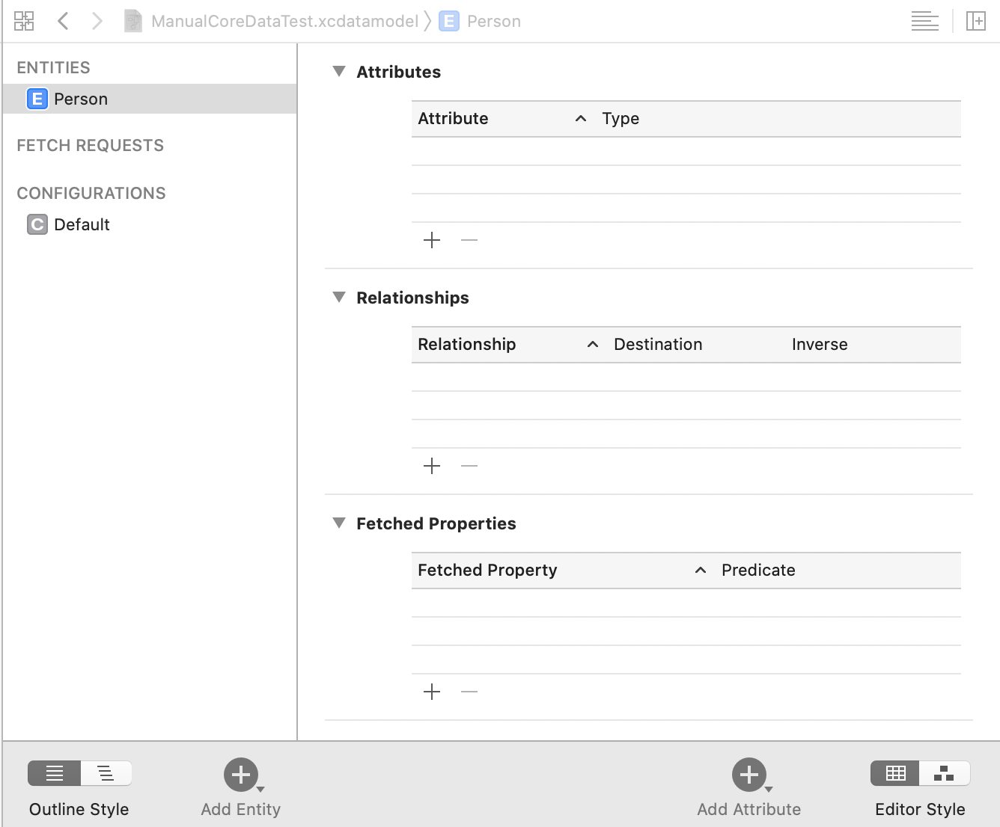

现在对`Person`实体添加两个属性，添加`age`属性并设置`type`为`Integer 16`，添加`name`属性并设置`type`为`String`。

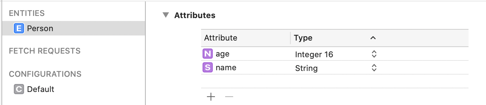

##2. 添加实体关联关系

创建两个实体`Department`和`Employee`，并且在这两个实体中分别添加一些属性，下面将会根据这两个实体来添加关联关系。

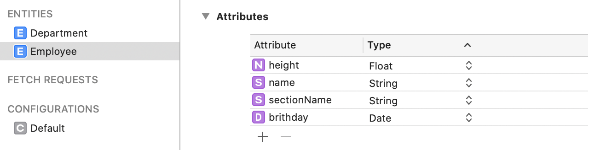
<center>Employee实体</center>

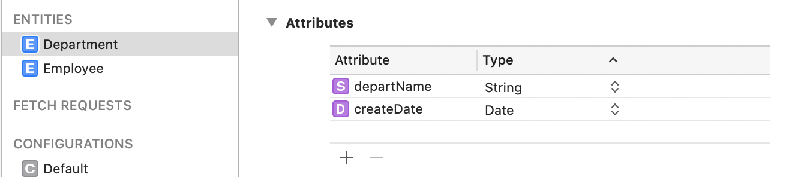

<center>Department实体</center>

给`Employee`实体添加关系，在`Relationships`的位置点击`+`，添加一个关联关系，添加关系的名称设为`department`。

选择`Department`实体添加关系，在`Relationships`的位置点击`+`，添加一个关联关系，添加关系的名称设为`employee`。

选择`Employee`实体关系，类型设置为`Department`，`Inverse`设置为`employee`	。选择`Department`实体关系，类型设置为`Employee`，`Inverse`设置为`department`。

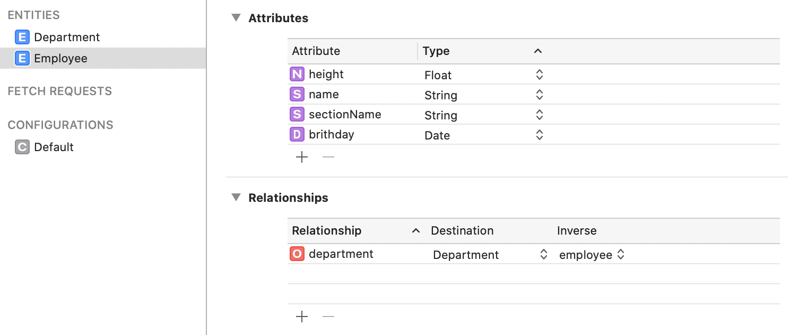
<center>Employee实体关系</center>

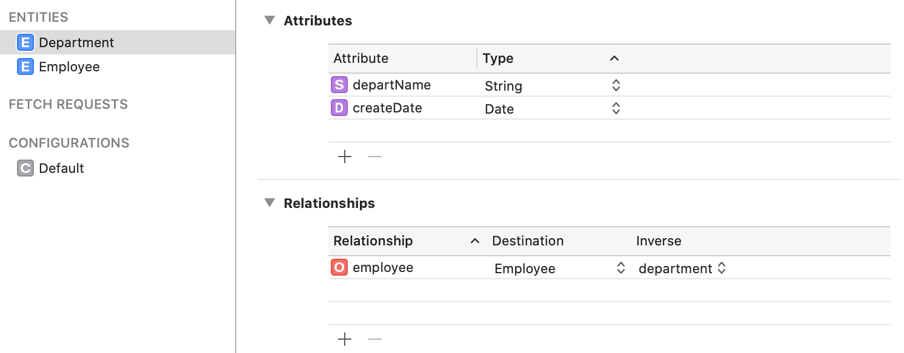

<center>Department实体关系</center>

选择`Department`实体关系，在右边的属性中，将`Type`设置为`To Many`一对多的关系。这里默认是`To One`一对一，上面的`Employee`就是一对一的关系。也就符合一个`Department`可以有多个`Employee`，而`Employee`只能有一个`Department`的情况，这也是符合常理。

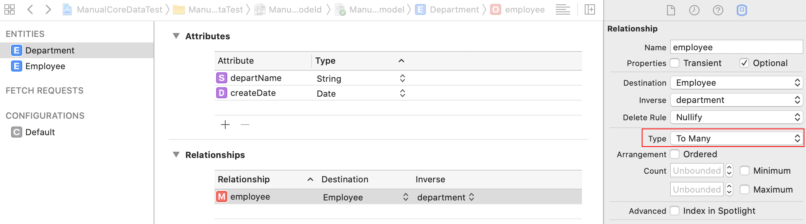

`RelationShips`类似于`SQLite`的外键，定义了在同一个模型中，实体与实体之间的关系。可以定义为一对一关系或一对多关系，也可以定义单向或双向的关系，根据需求来确定。如果是一对多的关系，默认是使用`NSSet`集合来存储模型。

###2.1 Fetched Properties

`Fetched Properties`用于定义查询操作，和`NSFetchRequest`功能相同。定义`fetchedProperty`对象后，可以通过`NSManagerObjectModel`类的`fetchRequestFromTemplateWithName:substitutionVariables:`方法或其他相关方法获取这个`fetchedProperty`对象。

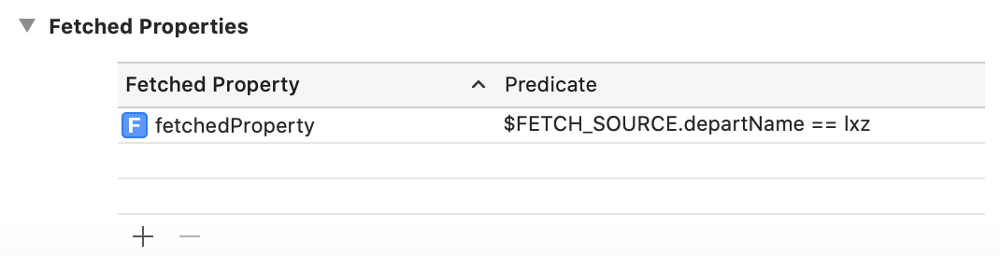

获取这个对象后，系统会默认将这个对象缓存到一个字典中，缓存之后也可以通过`fetchedProperty`字典获取`fetchedProperty`对象。

###2.2 Data Model Inspector

选中一个实体后，右侧的侧边栏（`Data Model Inspector`）还有很多选项，这些选项可以对属性进行配置。根据不同的属性类型，侧边栏的显示也不太一样，下面是一个`String`类型的属性。

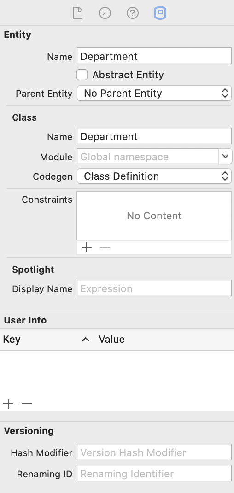

####2.2.1 属性设置

+ **default Value：**设置默认值，除了二进制不能设置，其他类型几乎都能设置，其他类型几乎都能设置。
+ **optional：**在使用时是否可选，也可以理解为如果设置为`NO`，只要向`NSManagedObjectContext`进行`save`操作，这个属性是否必须有值。否则`NSManagedObjectContext`进行操作时会失败并返回一个`error`，该选项默认为`YES`。
+ **transient：**设置当前属性是否只存在于内存，不被持久化到本地，如果设置为`YES`，这个属性就不参与持久化操作，属性的其他操作没有区别。`transient`非常适合存储一些在内存中缓存的数据，例如存储临时数据，这些数据每次都是不同的，而且不需要进行本地持久化，所以可以声明为`transient`的属性。
+ **indexed：**设置当前属性是否是索引。添加索引后可以有效的提升检索操作的速度。但是对于删除这样的操作，删除索引后其他地方还需要做出相应的变化，所以速度会比较慢。
+ **Validation：**通过`Validation`可以设置`Max Value`和`Min Value`，通过这两个条件来约定数据，对数据的存储进行一个验证。数值类型都有相同的约定方式，而字符串则是约定长度，`data`是约定时间。
+ **Reg.Ex.(`Regular Expression`)：**可以设置正则表达式，用来验证和控制数据，不对数据自身产生影响。（只能应用于`String`类型）。
+ **Allows External Storage：**当存储二进制文件时，如果遇到比较大的文件，是否存储在存储区之外。如果选择`YES`，存储文件大小超过`1MB`的文件，都会存储在存储区之外。否则大型文件存储在存储区内，会造成`SQLite`进行表操作时，效率受到影响。

###2.3 Relationships设置

+ **delete rule：**定义关联属性的删除规则。在当前对象和其他对象有关联关系时，当前对象被删除后与之关联对象的反应。这个参数有四个枚举值，代码对应着模型文件的相同选项。
	1. **No Action** 删除后没有任何操作，也不会将关联对象的关联属性指向`nil`。删除后使用关联对象的关联属性，可能会导致其他问题。
	2. **Nullify** 删除后会将关联对象的关联属性指向`nil`，这是默认值。
	3. **Cascade** 删除当前对象后，会将与之关联的对象也一并删除。
	4. **Deny** 在删除当前对象时，如果对象还指向其他关联对象，则当前对象不能被删除。
+ **Type：**主要有两种类型，`To One`和`To Many`，表示当前关系是一对一还是一对多。

###2.4 Entity

+ **Parent Entity：** 可以在实体中创建继承关系，在一个实体的菜单栏中通过`Parent Entity`可以设置父实体，这样就存在了实体的继承关系，最后创建出来的托管模型类也是具有继承关系的。
	
	>注意：继承关系中属性名不要相同。使用了这样的继承关系后，系统会将子类继承父类的数据，存在父类的表中，所有继承自同一父类的子类都会将父类部分存放在父类的表中。这样可能会导致父类的表中数据量过多，造成性能问题。

###2.5 Fetch Requests

在模型文件中`Entities`下面有一个`Fetch Requests`，这个也是配置请求对象的。


上面是对`Employee`实体的`height`属性配置的`Fetch Request`，这里配置的`height`要小于2米。配置之后可以通过`NSManagedObjectModel`类的`fetchRequestTemplateName:`方法获取这个请求对象，参数是这个请求配置的名称，也就是`EmployeeFR`。

###2.6 EditorStyle

这是我认为`CoreData`最大的优势之一，可视化的模型文件结构。可以很清楚的看到实体和属性的关系，以及实际之间的对应关系。

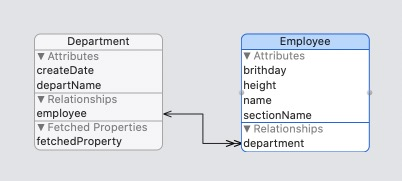

图标看起来更加直观，而图表在操作上也有一些比`Table`更方便的地方。例如在`Table`的状态下添加两个实体的关联关系，如果只做一次关联操作，**默认是单向的关系**。而在`Graph`的状态下，按住`Control`对两个图表进行连线，两个实体的结果就是双向关联的关系。

##3. 手动创建实体

假设不使用`.xcdatamodeld`模型文件，全都是纯代码，怎么在项目里创建实体啊？这样的话就需要通过代码创建实体描述、关联描述等信息，然后设置给`NSManagedObjectModel`对象。而使用模型文件的话一般都是通过`NSManagedObjectModel`对象来读取文件。
>如果是纯代码的话，苹果更推荐使用`KVC`的方式存取值，然后所有托管对象都用`NSManagedObject`创建。但是这样存在的问题很多，开发成本比较大、使用不方便等等。最大的问题就是写数学名的`key`字符串，很容易出错，而且这样失去了`CoreData`原有的优点。所以还是推荐使用`.xcdatamodeld`模型文件的开发方式。

##4. 创建托管对象类文件

###4.1 创建文件

创建实体后，就可以根据对应的实体，生成开发中使用的基于`NSManagedObject`类的托管对象类文件。

点击后缀名为`.xcdatamodeld`的模型文件，选择`Xcode`的`Editor -> Create NSManagedObjectSubclass -> 选择模型文件 -> 选择实体`，生成`Department`实体对应的托管对象类文件。

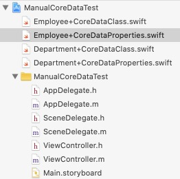

使用上面的方法生成托管对象类文件，默认是使用`Swift`语言的。如果需要生成`Objective-C`的托管对象类文件需要将实体的`Code Generation`属性设置为`Objective-C`。

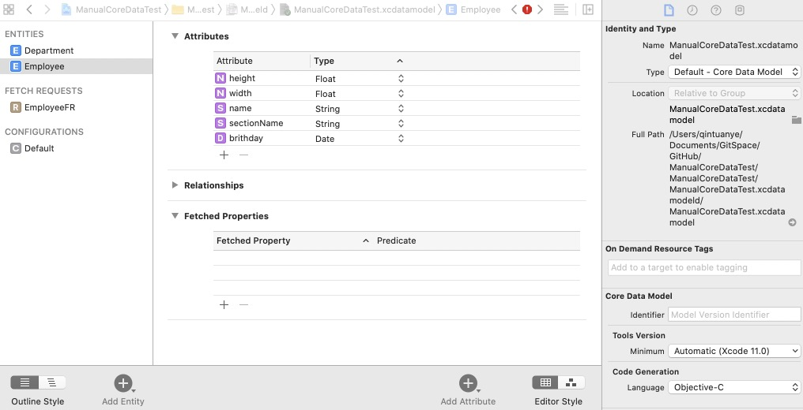

通过上面的方法生成了`CoreData`的托管对象类文件，但是现在编译工程将会报重复文件的错误。因此需要在工程配置中的托管对象类文件删除，这样在代码中一样可以使用`CoreData`生成的类。

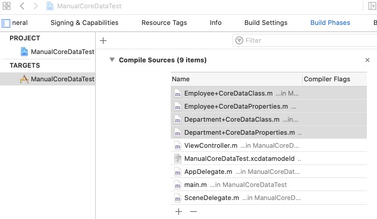

我们可以看到生成的是`Category`文件，为什么是`Category`文件？先打开类文件进去看看。

**Category**

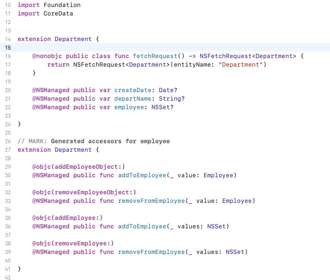

`CoreDataProperties`中会生成实体中声明的`Attributes`和`Relationships`中的属性，其中一对多关系是用`NSSet`存储的属性，如果是一对一的关系则是非集合的对象类型属性。再看类文件中，所有属性都用`@dynamic`修饰，`CoreData`会在运行时动态为所有`Category`中的属性生成实现代码，所以这里用`@dynamic`修饰。
一对多关系一般都是一个属性对应四个方法，方法的实现也是在运行时动态实现的，方法都是用来操作集合对象的。

###4.2 托管对象类文件

点击系统生成的托管对象类文件，此类是继承自`NSManagedObject`类的。可以看到里面非常干净，没有其他逻辑代码。

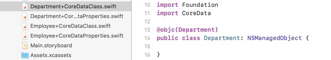

这里就是编写此类逻辑代码的地方，当然也可以什么都不写，看需求啦。

###4.3 任意类型属性

实体支持创建任意继承自`NSObject`类的属性。项目中创建的类在下拉列表中并不会体现，可以在属性类型选择`transformable`类型，然后生成托管对象类文件的时候，系统会将这个属性声明为`id`类型，在创建类文件后，可以直接手动更改这个属性的类型为我们想要的类型。

对于手动设置的属性有一个要求，属性所属的类必须是遵守`NSCoding`协议，因为这个属性要被归档到本地。

###4.4 标量类型

创建托管对象类文件时，实体属性的类型无论是选择的`integer32`还是`float`，只要是基础数据类型，最后创建出来的默认都是`NSNumber`类型的，这是`Xcode`默认的。

如果需要生成的属性是基础数据类型，可以在创建文件时勾选`Use Scalar Type`选项，这样就告诉系统需要生成标量类型属性，创建出来的属性就是`int64_t`、`float`这样的基础数据类型。

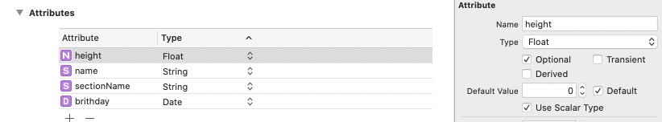

###4.5 更新文件

当前模型对应的实体发生改变后，需要重新生成模型`Category`文件。生成步骤和上面一样，主要是替换`Category`文件，托管对象文件不会被替换。生成文件时**不需要删除，直接替换文件**。

##5. CoreData增删改查

###5.1 先讲讲NSManagedObjectContext

在`iOS5`之前创建`NSManagedObjectContext`对象时，都是直接通过`init`方法来创建。`iOS5`之后苹果更加推荐使用`initWithConcurrencyType:`方法来创建，在创建的时候指定当前是什么类型的并发队列，初始化方法参数是一个枚举值。

`NSManagedObjectContext`初始化方法的枚举值参数主要有三个类型：
+ **NSConfinementConcurrencyType** 如果使用`init`方法初始化上下文，默认就是这个并发类型。在`iOS9`之后已经被苹果废弃，不建议用这个`API`，调用某些比较新的`CoreData`的`API`可能会导致崩溃。
+ **NSPrivateQueueConcurrencyType** 私有并发队列类型，操作都是在子线程中完成的。
+ **NSMainQueueConcurrencyType** 主并发队列类型，如果涉及到`UI`相关的操作，应该考虑使用这个参数初始化上下文。

如果还使用init方法，可能会对后面推出的一些`API`不兼容，导致多线程相关的错误。例如下面的错误，因为如果没有显示的设置并发类型，默认是一个已经弃用的`NSConfinementConcurrencyType`类型就会导致新推出的`API`发生不兼容的崩溃错误。

```
Terminating app due to ucaught exception 'NSInvalidArgumentException', reason: 'NSConfinementConcurrencyType context
```

###5.3 创建NSManagedObjectContext

下面是根据`Company`模型文件，创建了一个主队列并发类型的`NSManagedObjectContext`。

```Objective-C
// 创建上下文对象，并发队列设置为主队列
NSManagedObjectContext *context = [[NSManagedObjectContext alloc] initWithConcurrencyType:NSMainQueueConcurrencyType];

// 创建托管对象模型，并使用ManualCoreData.xcdatamodeId路径当中初始化参数
NSURL *modelPath = [[NSBundle mainBundle] URLForResource:@"ManualCoreDataTest.momd" withExtension:nil];
if (@available(iOS 11.0, *)) {} else {
    modelPath = [modelPath URLByAppendingPathComponent:@"ManualCoreDataTest.mom"];
}
NSManagedObjectModel *model = [[NSManagedObjectModel alloc] initWithContentsOfURL:modelPath];

// 创建持久化存储调度器
NSPersistentStoreCoordinator *coordinator = [[NSPersistentStoreCoordinator alloc] initWithManagedObjectModel:model];

// 创建并关联SQLite数据库文件，如果已经存在则不会重复创建
NSString *dataPath = NSSearchPathForDirectoriesInDomains(NSDocumentDirectory, NSUserDomainMask, YES).lastObject;
dataPath = [dataPath stringByAppendingFormat:@"/%@.sqlite", @"ManualCoreDataTest"];
NSError *error;
[coordinator addPersistentStoreWithType:NSSQLiteStoreType configuration:nil URL:[NSURL fileURLWithPath:dataPath] options:nil error:&error];
if (error) {
    NSLog(@"error: %@", error);
}

// 上下文对象设置属性为持久化存储器
context.persistentStoreCoordinator = coordinator;
```

###5.4 momd文件

`NSManagedObjectContext`下面出行了`momd`的字样，这是什么东西？

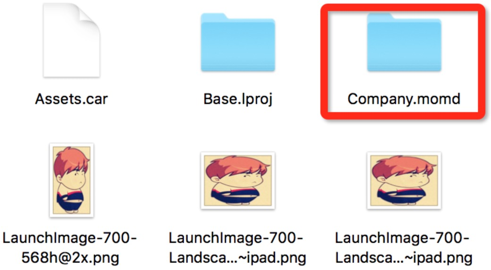

在创建后缀为`.xcdatamodeld`模型文件后，模型文件在编译器将会被编译为后缀为`.momd`的文件，存放在`.app`中，也就是`Main Bundle`中。在存在多个模型文件时，我们需要通过加载不同的`.momd`文件，来创建不同的`NSManagedObjectModel`对象，每个`NSManagedObjectContext`对应着不同的模型文件。

`NSManagedObjectModel`类中包含了模型文件中的所有`entities`、`configurations`、`fetchRequests`的描述。虽然`.momd`文件是支持存放在`.app`中的，其他人可以通过打开`.app`包看到这个文件。但是这个文件时经过编码的，并不会知道这个`.momd`文件中的内容，所以这个文件是非常安全的。通过`NSManagerObjectModel`获取模型文件描述后，来创建和关联数据库，并交给`NSPersistentStoreCoordinator`，这个类在`CoreData`框架体系中起到了**”中枢“**的作用。对上层起到了提供简单的调用接口，并向上层隐藏持久化实现逻辑。对下层起到了**协调多个持久化存储对象（`NSPersistentStoreCoordinator`），**使下层只需要专注持久化相关逻辑。

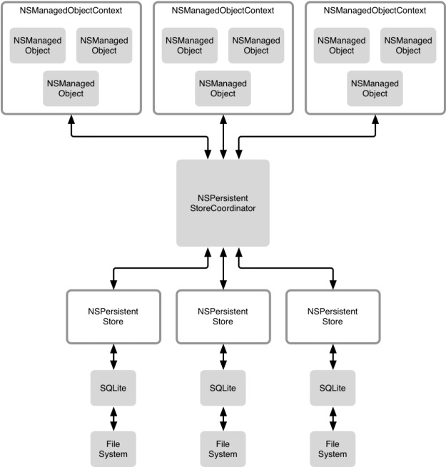

`addPersistentStoreWithType: configuration: URL: options: error:`方法是`NSPersistentStoreCoordinator`创建并关联数据库的部分，关联本地数据库后会返回一个`NSPersistentStoreCoordinator`类型对象，这个对象负责具体持久化存储的实现。可以看到这个方法是一个实例方法，也就是可以添加多个持久化存储对象，并且多个持久化存储对象都关联一个`NSPersistentStoreCoordinator`，这是允许的，在上面的图中也看到了这样的结构。但是这样的需求并不多，而且管理起来比较玛法，一般都不会这样做。

`NSPersistentStoreCoordinator`有四种可选的持久化存储方案，用得最多的是SQLite的方式。其中`Binary`和`XML`这两种方式，在进行数据操作时，需要将整个文件加载到内存中，这样对内存的消耗是最大的。

+ **NSSQLiteStoreType：**SQLite额数据库
+ **NSXMLStoreType：**XML文件
+ **NSBinaryStoreType：**二进制文件
+ **NSInMemoryStoreType：**直接存储在内存中

###5.5 插入操作

```Objective-C
//创建托管对象，并指明创建的托管对象所属实体名
Employee *emp = [NSEntityDescription insertNewObjectForEntityForName:@"Employee" inManagedObjectContext:context];
emp.name = @"lxz";
emp.height = 1.7;
emp.brithday = [NSDate date];

// 通过上下文保存对象，并在保存前判断是否有更改
NSError *error = nil;
if (context.hasChanges) {
    [context save:&error];
}

// 处理错误
if (error) {
    NSLog(@"CoreData Insert Data Error: %@", error);
}
```

通过`NSEntityDescription`的`insert`类方法，生成并返回一个`Employee`托管对象，并将这个对象插入到指定的上下文中。

`NSManagedObjectContext`将操作的数据存放在缓存层，只有调用`NSManagedObjectContext`的`save`方法后，才会真正对数据库进行操作，否则这个对象只是存在内存中，这样做避免了频繁的数据库访问。

###5.6 删除操作

```Objective-C
// 建立获取数据的请求对象，指明对Employee实体进行删除操作
NSFetchRequest *request = [NSFetchRequest fetchRequestWithEntityName:@"Employee"];

// 创建谓语对象，过虑出符合要求的对象，也就是要删除的对象
NSPredicate *predicate = [NSPredicate predicateWithFormat:@"name = %@", @"lxz"];
request.predicate = predicate;

// 执行获取操作，找到要删除的对象
NSError *error = nil;
NSArray<Employee *> *employees = [context executeFetchRequest:request error:&error];

// 遍历符合删除要求的对象数组，执行删除操作
[employees enumerateObjectsUsingBlock:^(Employee * _Nonnull obj, NSUInteger idx, BOOL * _Nonnull stop) {
    [context deleteObject:obj];
}];

// 保存上下文
if (context.hasChanges) {
    [context save:nil];
}

// 错误处理
if (error) {
    NSLog(@"CoreData delete Data Error: %@", error);
}
```

首先获取需要删除的托管对象，遍历获取的对象数组，诸葛删除后调用`NSManagedObjectContext`的`save`方法保存。

###5.7 修改操作

```Objective-C
// 建立获取数据的请求对象，并指明操作的实体为Employee
NSFetchRequest *request = [NSFetchRequest fetchRequestWithEntityName:@"Employee"];

// 创建谓语对象，设置过虑条件
NSPredicate *predicate = [NSPredicate predicateWithFormat:@"name = %@", @"lxz"];
request.predicate = predicate;

// 执行获取请求，获取到符合要求的托管对象
NSError *error = nil;
NSArray<Employee *> *employees = [context executeFetchRequest:request error:&error];
[employees enumerateObjectsUsingBlock:^(Employee * _Nonnull obj, NSUInteger idx, BOOL * _Nonnull stop) {
    obj.height = 3.f;
}];

// 将上面的修改进行存储
if (context.hasChanges) {
    [context save:nil];
}

// 错误处理
if (error) {
    NSLog(@"CoreData Update Data Error : %@", error);
}
```

和上面一样，首先获取到需要更改的托管对象，更改完成后调用`NSManagedObjectContext`的`save`方法持久化到本地。

###5.8 查找操作

```Objective-C
// 建立获取数据的请求对象，指明操作的实体为Employee
NSFetchRequest *request = [NSFetchRequest fetchRequestWithEntityName:@"Employee"];

// 执行获取操作，获取所有Employee托管对象
NSError *error = nil;
NSArray<Employee *> *employees = [context executeFetchRequest:request error:&error];
[employees enumerateObjectsUsingBlock:^(Employee * _Nonnull obj, NSUInteger idx, BOOL * _Nonnull stop) {
    NSLog(@"Employee Name: %@, Height: %f, Brithday: %@", obj.name, obj.height, obj.brithday);
}];
```

查找操作最简单粗暴，因为是演示代码，所以直接将所有`Employee`表中的托管对象加载出来。在实际开发中肯定不会这样做，只需要加载需要的数据。

##6. 总结

在`CoreData`中所有的托管对象被创建出来后，都是关联着`NSManagedObjectContext`对象的。所以在对象进行任何操作后，都会被记录在`NSManagedObjectContext`中。在最后调用`NSManagedObjectContext`的`save`方法后，`NSManagedObjectContext`会将操作交给`NSPersistentStoreCoordinator`去处理，`NSPersistentStoreCoordinator`将会将这个存储任务指派给`NSPersistentStore`对象。


