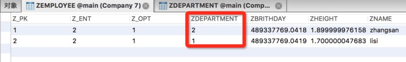
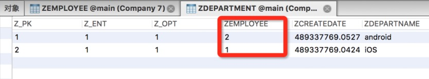
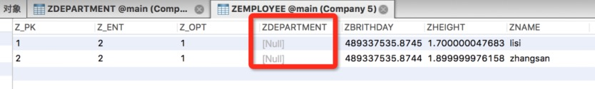
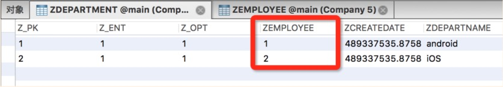

[toc]

#设置查询条件

执行下面`NSManagedObjectContext`的`fetchRequest`方法，一般都需要传入一个`NSFetchRequest`类型的参数。这个`requet`参数可以做一些设置操作，这样就可以以较优的性能获取指定的数据。

```Objective-C
- (nullable NSArray *)executeFetchRequest:(NSFetchRequest *)request error:(NSError **)error;
```

##1.1 NSFetchRequest

在执行`fetch`操作前，可以给`NSFetchRequest`设置一些参数，这些参数包括谓词、排序等条件下，下面是一些基础的设置。

+ 设置查找哪个实体，从数据库的角度来看就是查找哪张表，通过`fetchRequestWithEntityName:`或初始化方法来指定表名。
+ 通过`NSPredicate`类型的属性，可以设置查找条件，这个属性在开发中用得最多。`NSPredicate`可以包括固定格式的条件以及**正则表达式**。
+ 通过 `sortDescriptors` 属性，可以设置获取结果数组的排序方式，这个属性是一个数组类型，也就是**可以设置多种排序条件。**（但是注意条件不要冲突）
+ 通过 `fetchOffset` 属性设置从查询结果的第几个开始获取，通过 `fetchLimit` 属性设置每次获取多少个。主要用于分页查询。

`NSManagedObjectContext` 执行 `fetch`操作后，获取的结果是以数组的形式存储的，数组中存储的就是托管对象。`NSFetchRequest` 提供了参数 `resultType`，参数类型是一个枚举类型。通过这个参数，可以设置执行 `fetch` 操作后返回的数据类型。

+ **NSManagedObjectResultType：**返回值是 `NSManagedObject` 的子类，也就是托管对象，这是默认选项。
+ **NSManagedObjectIDResultType：**返回 `NSManagedObjectID` 类型的对象，也就 `NSManagedObject` 的 `ID`，对内存占用比较小。`NSManagedObjectContext` 可以通过 `NSManagedObjectID` 对象获取对应的托管对象，并且可以通过缓存 `NSManagedObjectID` 参数来节省内存消耗。
+ **NSDictionaryResultType：**返回字典类型对象。
+ **NSCountResultType：**返回请求结果的 `count` 值，这个操作是发生在数据库层级的，并不需要将数据加载到内存中。

##1.2 设置获取条件

```Objective-C
// 建立获取数据的请求对象，并指明操作Employee表
NSFetchRequest *request = [NSFetchRequest fetchRequestWithEntityName:@"Employee"];

// 设置请求条件，通过设置的条件，来过虑出需要的数据
NSPredicate *predicate = [NSPredicate predicateWithFormat:@"name = %@", @"lxz"];
request.predicate = predicate;

// 设置请求结果排序方式，可以设置一个或一组排序方式，最后将所有的排序方式添加到排序数组中
NSSortDescriptor *sort = [NSSortDescriptor sortDescriptorWithKey:@"height" ascending:YES];
// NSSortDescriptor的操作都是在SQLite层级完成的，不会将对象加载到内存中，所以对内存的消耗非常小的
request.sortDescriptors = @[sort];

// 执行获取请求操作，获取的托管对象将会被存储在一个数组中并返回
NSError *error = nil;
NSArray<Employee *> *employees = [context executeFetchRequest:request error:&error];
[employees enumerateObjectsUsingBlock:^(Employee * _Nonnull obj, NSUInteger idx, BOOL * _Nonnull stop) {
    NSLog(@"Employee Name: %@, Height: %f, Birthday: %@", obj.name, obj.height, obj.brithday);
}];

// 错误处理
if (error) {
    NSLog(@"CoreData Fetch Data Error: %@", error);
}
```

这里设置 `NSFetchRequest` 对象的一些请求条件，设置查找 `Employee` 表中 `name` 为 `lxz` 的数据，并且将所有符合的数据用 `height` 值**升序**的方法排列。

##1.3 有实体关联关系

一个模型文件中的不同实体间，可以设置实体间的关联关系，这个在之前的文章中讲过。实体关联关系分为**一对一**或**一对多**，也可以设置是否**双向关联**。

这里演示的实体只是简单的 `To One` 的关系，并且下面会给出设置是否双向关联的区别对比。

###1.3.1 插入实体

```Objective-C
// 创建托管对象，并将其关联到指定的MOC上
Employee *zsEmployee = [NSEntityDescription insertNewObjectForEntityForName:@"Employee" inManagedObjectContext:context];
zsEmployee.name = @"zhangsan";
zsEmployee.height = 1.9f;
zsEmployee.brithday = [NSDate date];

Employee *lsEmployee = [NSEntityDescription insertNewObjectForEntityForName:@"Employee" inManagedObjectContext:context];
lsEmployee.name = @"lisi";
lsEmployee.height = 1.7f;
lsEmployee.brithday = [NSDate date];

Department *iosDepartment = [NSEntityDescription insertNewObjectForEntityForName:@"Department" inManagedObjectContext:context];
iosDepartment.departName = @"iOS";
iosDepartment.createDate = [NSDate date];
iosDepartment.employee = zsEmployee;

Department *androidDepartment = [NSEntityDescription insertNewObjectForEntityForName:@"Department" inManagedObjectContext:context];
androidDepartment.departName = @"android";
androidDepartment.createDate = [NSDate date];
androidDepartment.employee = lsEmployee;

// 执行存储操作
NSError *error = nil;
if (context.hasChanges) {
    [context save:&error];
}

// 错误处理
if (error) {
    NSLog(@"Association Table add Data Error: %@", error);
}
```

可以看到上面所有的托管对象创建时，都使用 `NSEntityDescription` 的 `insert` 方法创建，**并和上下文建立关系**。这时就想问了，我能直接采用传统的 `init` 方法创建吗？

**会崩的😱！创建托管对象时需要指定NSManagedObjectContext**，在运行时动态的生成 `set`、`get` 方法。但是直接通过 `init` 方法初始化的对象，系统是不知道这里是需要系统自身生成 `set`、`get`方法的，而且系统也不知道应该对应哪个 `NSManagedObjectContext`，会导致方法未实现的崩溃。所以就出现了开发中经常出现的错误，如下面崩溃信息：

```
- [Employee setName:]: unrecognized selector sent to instance 0x7fa665900f60
```

###1.3.2 双向关联

在手动向项目中添加CoreData的文章中提到过双向关联的概念，也就是设置 `Relationship` 时 `Inverse` 是否为空。下面是 `Employee` 和 `Department` 在数据库中，设置 `inverse` 和没有设置 `inverse` 的两种数据存储，可以很清晰的对比出设置双向关联的区别。
测试代码还是用上面插入实体的代码，只是更改 `inverse` 选项。

**设置双向关联**





**未设置双向关联**





从图中可以看出，未设置双向关联的实体，`Department` 关联 `Employee` 为属性并存储后，`Department`表中的关系是存在的，但 `Employee`表中的关系依然是空的。而设置双向关联后的实体，在 `Department` 关联 `Employee` 为属性并存储后，`Employee`在表中自动设置了和 `Department`的关系。

###1.3.3 查询操作

```Objective-C
// 创建获取数据的请求对象，并指明操作Department表
NSFetchRequest *request = [NSFetchRequest fetchRequestWithEntityName:@"Department"];

// 设置请求条件，设置employee的name为请求条件。NSPredicate的好处在于，可以设置keyPath条件
NSPredicate *predicate = [NSPredicate predicateWithFormat:@"employee.name = %@", @"lxz"];
request.predicate = predicate;

// 执行查找操作
NSError *error = nil;
NSArray<Department *> *departments = [context executeFetchRequest:request error:&error];
[departments enumerateObjectsUsingBlock:^(Department * _Nonnull obj, NSUInteger idx, BOOL * _Nonnull stop) {
    NSLog(@"Department Search Result DepartName: %@, employee name: %@", obj.departName, obj.employee.name);
}];

// 错误处理
if (error) {
    NSLog(@"Department Search Error : %@", error);
}
```

查找 `Department` 实体，并打印实体内容。就像上面讲的双向关系一样，有关联关系的实体，自己被查找出来后，也会将与之关联的其他实体也查找出来，并且查找出来的实体都是关联着 `NSManagedObjectContext` 的。

##1.4 分页查询

```Objective-C
// 创建获取数据的请求对象，并指明操作Employee表
NSFetchRequest *request = [NSFetchRequest fetchRequestWithEntityName:@"Employee"];

// 设置查找起点，这里是从搜索结果的第六个开始获取
request.fetchOffset = 6;

// 设置分页，每次请求获取六个托管对象
request.fetchLimit = 6;

// 设置排序规则，这里设置身高升序排序
NSSortDescriptor *descriptor = [NSSortDescriptor sortDescriptorWithKey:@"height" ascending:YES];
request.sortDescriptors = @[descriptor];

// 执行查询操作
NSError *error = nil;
NSArray<Employee *> *employees = [context executeFetchRequest:request error:&error];
[employees enumerateObjectsUsingBlock:^(Employee * _Nonnull obj, NSUInteger idx, BOOL * _Nonnull stop) {
    NSLog(@"Page Search Result Name : %@, height : %f", obj.name, obj.height);
}];

// 错误处理
if (error) {
    NSLog(@"Page Search Data Error: %@", error);
}
```

##1.5 模糊查询

```Objective-C
// 创建获取数据的请求对象，设置对Employee表进行操作
NSFetchRequest *request = [NSFetchRequest fetchRequestWithEntityName:@"Employee"];

// 创建模糊查询条件。这里设置的带通配符的查询，查询条件的结果包含lxz
NSPredicate *predicate = [NSPredicate predicateWithFormat:@"name LIKE %@", @"*lxz*"];
request.predicate = predicate;

// 执行查询操作
NSError *error = nil;
NSArray<Employee *> *employees = [context executeFetchRequest:request error:&error];
[employees enumerateObjectsUsingBlock:^(Employee * _Nonnull obj, NSUInteger idx, BOOL * _Nonnull stop) {
    NSLog(@"Fuzzy Search Result Name : %@, height : %f", obj.name, obj.height);
}];

// 处理错误
if (error) {
    NSLog(@"Fuzzy Search Data Error : %@", error);
}
```

上面是使用**通配符**的方式进行**模糊查询**，`NSPredicate` 支持多种形式的模糊查询，下面列举一些简单的匹配方式。模糊查询条件**对大小写不敏感**，所以查询条件大小写均可。

##1.6 加载请求模板

在之前的文章中谈到**在模型文件中设置请求模板**，也就是在 `.xcdatamodeld` 文件中，设置 `FetchRequexts`，使用时可以通过对应的 `NSManagedObjectModel` 获取设置好的模板。

```Objective-C
// 通过NSManagedObjectContext获取模型文件对应的托管对象模型
NSManagedObjectModel *model = context.persistentStoreCoordinator.managedObjectModel;
// 通过.xcdatamodeld文件中设置的模板名，获取请求对象
NSFetchRequest *fetchRequest = [model fetchRequestTemplateForName:@"EmployeeFR"];

// 请求数据， 下面的操作和普通请求一样
NSError *error = nil;
NSArray <Employee *> *dataList = [context executeFetchRequest:fetchRequest error:&error];
[dataList enumerateObjectsUsingBlock:^(Employee * _Nonnull obj, NSUInteger idx, BOOL * _Nonnull stop) {
    NSLog(@"Employee.count = %ld, Employee.height = %f", dataList.count, obj.height);
}];

// 错误处理
if (error) {
    NSLog(@"Execute Fetch Request Error : %@", error);
}
```

