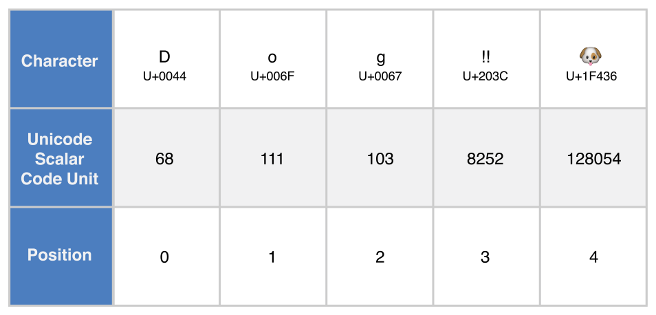

[toc]

甲*串*是一系列字符，如的或。Swift字符串由类型表示。a的内容可以通过多种方式访问，包括作为值的集合。`"hello, world"``"albatross"``String``String``Character`

Swift的`String`和`Character`类型提供了一种快速，符合Unicode的方式来处理代码中的文本。字符串创建和操作的语法轻巧易读，具有类似于C的字符串文字语法。字符串连接就像将两个字符串与`+`运算符组合起来一样简单，并且通过在常量或变量之间进行选择来管理字符串的可变性，就像Swift中的其他任何值一样。您还可以在称为字符串插值的过程中使用字符串将常量，变量，文字和表达式插入较长的字符串中。这样可以轻松创建用于显示，存储和打印的自定义字符串值。

尽管语法简单，但是Swift的`String`类型是一种快速，现代的字符串实现。每个字符串都由独立于编码的Unicode字符组成，并支持以各种Unicode表示形式访问这些字符。

> 注意
>
> Swift的`String`类型与Foundation的`NSString`类联系在一起。Foundation还扩展`String`为暴露由定义的方法`NSString`。这意味着，如果您导入Foundation，则可以`NSString`在`String`不强制转换的情况下访问这些方法。
>
> 有关`String`与Foundation和Cocoa一起使用的更多信息，请参见[在String和NSString之间桥接](https://developer.apple.com/documentation/swift/string#2919514)。

# 字符串文字

您可以`String`在代码中包含预定义值作为*字符串文字*。字符串文字是由双引号（`"`）包围的字符序列。

使用字符串文字作为常量或变量的初始值：

```swift
let someString = "Some string literal value"
```

请注意，Swift会`String`为`someString`常量推断类型，因为它是使用字符串文字值初始化的。

## 多行字符串文字

如果您需要一个跨越多行的字符串，请使用多行字符串文字-一种由三个双引号引起来的字符序列：

```swift
let quotation = """
The White Rabbit put on his spectacles.  "Where shall I begin,
please your Majesty?" he asked.

"Begin at the beginning," the King said gravely, "and go on
till you come to the end; then stop."
"""
```

多行字符串文字包括其右引号和右引号之间的所有行。字符串从左引号（`"""`）之后的第一行开始，到右引号前的一行结束，这意味着下面的字符串都不以换行符开头或结尾：

```swift
let singleLineString = "These are the same."
let multilineString = """
These are the same.
"""
```

当您的源代码在多行字符串文字中包含一个换行符时，该换行符也会出现在字符串的值中。如果您想使用换行符使源代码更易于阅读，但又不想让换行符成为字符串值的一部分，请在`\`这些行的末尾写一个反斜杠（）：

```swift
let softWrappedQuotation = """
The White Rabbit put on his spectacles.  "Where shall I begin, \
please your Majesty?" he asked.

"Begin at the beginning," the King said gravely, "and go on \
till you come to the end; then stop."
"""
```

要制作以换行开头或结尾的多行字符串文字，请将空白行写为第一行或最后一行。例如：

```swift
let lineBreaks = """

This string starts with a line break.
It also ends with a line break.

"""
```

可以缩进多行字符串以匹配周围的代码。右引号（`"""`）之前的空格告诉Swift其余所有行之前要忽略的空格。但是，如果您在行的开头加上除右引号之前的空格，则将*其*包括在内。


在上面的示例中，即使整个多行字符串文字缩进了，字符串的第一行和最后一行也不以任何空格开头。中间行的缩进量比右引号多，因此它以该额外的四空格缩进开始。

## 字符串文字中的特殊字符

字符串文字可以包含以下特殊字符：

- 转义的特殊字符`\0`（空字符），`\\`（反斜杠），`\t`（水平制表符），`\n`（换行符），`\r`（回车），`\"`（双引号）和`\'`（单引号）
- 任意的Unicode标值，写为`\u{`*Ñ*`}`，其中*Ñ*是一个1-8位十六进制数（统一在讨论[的Unicode](https://docs.swift.org/swift-book/LanguageGuide/StringsAndCharacters.html#ID293)下文）

下面的代码显示了这些特殊字符的四个示例。该`wiseWords`常量包含两个转义的双引号。的`dollarSign`，`blackHeart`和`sparklingHeart`常量展示Unicode标格式：

```swift
let wiseWords = "\"Imagination is more important than knowledge\" - Einstein"
// "Imagination is more important than knowledge" - Einstein
let dollarSign = "\u{24}"        // $,  Unicode scalar U+0024
let blackHeart = "\u{2665}"      // ♥,  Unicode scalar U+2665
let sparklingHeart = "\u{1F496}" // 💖, Unicode scalar U+1F496
```

因为多行字符串文字使用三个双引号而不是一个双引号，所以您可以`"`在多行字符串文字中包含一个双引号（）而不进行转义。要将文本包含`"""`在多行字符串中，请至少使用引号之一。例如：

```swift
let threeDoubleQuotationMarks = """
Escaping the first quotation mark \"""
Escaping all three quotation marks \"\"\"
"""
```

## 扩展字符串定界符

您可以在*扩展定界符中*放置字符串文字，以在字符串中包含特殊字符，而无需调用其效果。您将字符串放在引号（`"`）内，并用数字符号（`#`）括起来。例如，打印字符串文字将打印换行符转义序列（），而不是在两行之间打印字符串。`#"Line 1\nLine 2"#\n`

如果您需要字符串文字中字符的特殊效果，请匹配转义字符（`\`）后字符串中数字符号的数量。例如，如果您的字符串是，并且您想换行，则可以改用。同样，也打破了界限。`#"Line 1\nLine 2"##"Line 1\#nLine 2"####"Line1\###nLine2"###`

使用扩展定界符创建的字符串文字也可以是多行字符串文字。您可以使用扩展定界符将文本包含`"""`在多行字符串中，从而覆盖以文字结尾的默认行为。例如：

```swift
let threeMoreDoubleQuotationMarks = #"""
Here are three more double quotes: """
"""#
```

# 初始化一个空字符串

要创建一个空`String`值作为构建更长字符串的起点，请为变量分配一个空字符串文字，或者`String`使用初始化语法初始化一个新实例：

```swift
var emptyString = ""               // empty string literal
var anotherEmptyString = String()  // initializer syntax
// these two strings are both empty, and are equivalent to each other
```

`String`通过检查其布尔`isEmpty`属性来确定值是否为空：

```swift
if emptyString.isEmpty {
    print("Nothing to see here")
}
// Prints "Nothing to see here"
```

# 字符串可变性

您`String`可以通过将某个变量分配给变量（在这种情况下可以修改）或常量（在这种情况下不能修改）来指明是否可以修改（或*mutated*）：

```swift
var variableString = "Horse"
variableString += " and carriage"
// variableString is now "Horse and carriage"

let constantString = "Highlander"
constantString += " and another Highlander"
// this reports a compile-time error - a constant string cannot be modified
```

> 注意
>
> 此方法与Objective-C和Cocoa中的字符串突变不同，在Objective-C和Cocoa中，您可以在两个类（`NSString`和`NSMutableString`）之间进行选择以指示是否可以对字符串进行突变。

# 字符串是值类型

Swift的`String`类型是一个*值类型*。如果创建一个新`String`值，则将该`String`值传递给函数或方法时，或将其分配给常量或变量时，将*复制*该值。在每种情况下，`String`都会创建现有值的新副本，并传递或分配新副本，而不是原始版本。值类型在[结构和枚举是值类型中](https://docs.swift.org/swift-book/LanguageGuide/ClassesAndStructures.html#ID88)进行了描述。

Swift的默认复制`String`行为可确保在函数或方法为您传递值时，无论`String`该`String`值来自何处，您显然都拥有该值。您可以确信，除非您自己修改，否则不会修改传递的字符串。

在后台，Swift的编译器优化了字符串的用法，因此仅在绝对必要时才进行实际复制。这意味着在将字符串作为值类型使用时，始终可以获得出色的性能。

# 使用角色

您可以通过- 循环遍历字符串来访问a的各个`Character`值：`Stringforin`

```swift
for character in "Dog!🐶" {
    print(character)
}
// D
// o
// g
// !
// 🐶
```

的`for`- `in`环中描述[对于-在循环中](https://docs.swift.org/swift-book/LanguageGuide/ControlFlow.html#ID121)。

另外，您可以`Character`通过提供`Character`类型注释从单字符字符串文字中创建独立的常量或变量：

```swift
let exclamationMark: Character = "!"
```

`String`可以通过将`Character`值数组作为参数传递给其初始值设定项来构造值：

```swift
let catCharacters: [Character] = ["C", "a", "t", "!", "🐱"]
let catString = String(catCharacters)
print(catString)
// Prints "Cat!🐱"
```

# 连接字符串和字符

`String`值可以与加法运算符（）一起添加（或*串联*`+`）以创建新`String`值：

```swift
let string1 = "hello"
let string2 = " there"
var welcome = string1 + string2
// welcome now equals "hello there"
```

您还可以使用附加赋值运算符（）将`String`值附加到现有`String`变量中`+=`：

```swift
var instruction = "look over"
instruction += string2
// instruction now equals "look over there"
```

您可以使用类型的方法将`Character`值附加到`String`变量：`String``append()`

```swift
let exclamationMark: Character = "!"
welcome.append(exclamationMark)
// welcome now equals "hello there!"
```

> 注意
>
> 您不能将`String`或附加`Character`到现有`Character`变量，因为一个`Character`值只能包含一个字符

如果您使用多行字符串文字构造更长的字符串的行，则希望字符串中的每一行都以换行符结尾，包括最后一行。例如：

```swift
let badStart = """
one
two
"""
let end = """
three
"""
print(badStart + end)
// Prints two lines:
// one
// twothree

let goodStart = """
one
two

"""
print(goodStart + end)
// Prints three lines:
// one
// two
// three
```

在上面的代码中，`badStart`与串联`end`会产生两行字符串，这不是理想的结果。由于的最后一行`badStart`不以换行符结尾，因此该行与的第一行合并`end`。相比之下，两行都`goodStart`以换行符结尾，因此，将其与`end`结果结合时，可以得到预期的三行。

# 字符串插值

*字符串插值*是通过`String`将常量，变量，文字和表达式的值包含在字符串文字中来构造新值的一种方法。您可以在单行和多行字符串文字中使用字符串插值。您插入字符串文字中的每个项目都用一对括号括起来，并以反斜杠（`\`）为前缀：

```swift
let multiplier = 3
let message = "\(multiplier) times 2.5 is \(Double(multiplier) * 2.5)"
// message is "3 times 2.5 is 7.5"
```

在上面的示例中，将的值`multiplier`插入到字符串文字中，如`\(multiplier)`。`multiplier`评估字符串插值以创建实际字符串时，该占位符将替换为的实际值。

的值`multiplier`也是该字符串后面较大表达式的一部分。该表达式计算的值并将结果（）插入字符串中。在这种情况下，表达式被写成包含在字符串文字中时的形式。`Double(multiplier) * 2.5``7.5``\(Double(multiplier) * 2.5)`

您可以使用扩展的字符串定界符来创建包含字符的字符串，否则这些字符将被视为字符串插值。例如：

```swift
print(#"Write an interpolated string in Swift using \(multiplier)."#)
// Prints "Write an interpolated string in Swift using \(multiplier)."
```

要在使用扩展定界符的字符串中使用字符串插值，请将反斜杠后的数字符号数与字符串开头和结尾的数字符号数匹配。例如：

```swift
print(#"6 times 7 is \#(6 * 7)."#)
// Prints "6 times 7 is 42."
```

> 注意
>
> 您在插值字符串内的括号内编写的表达式不能包含未转义的反斜杠（`\`），回车符或换行符。但是，它们可以包含其他字符串文字。

# 统一码

*Unicode*是用于在不同书写系统中编码，表示和处理文本的国际标准。它使您能够以标准化的形式表示来自任何语言的几乎所有字符，并且可以与诸如文本文件或网页之类的外部源进行读写。如本节所述，Swift的`String`和`Character`类型完全兼容Unicode。

## Unicode标量值

在幕后，Swift的本机`String`类型是根据*Unicode标量值*构建的。一个Unicode标量值为字符或改性剂的唯一的21位数字，如`U+0061`为（），或为（）。`LATIN SMALL LETTER A``"a"``U+1F425``FRONT-FACING BABY CHICK``"🐥"`

请注意，并非所有21位Unicode标量值都分配给一个字符-一些标量保留给以后分配或用于UTF-16编码。已分配给一个字符标量值通常还具有一个名字，如和在上面的实施例。`LATIN SMALL LETTER A``FRONT-FACING BABY CHICK`

## 扩展字素簇

Swift `Character`类型的每个实例都代表一个*扩展的字素簇*。扩展字素簇是一个或多个Unicode标量的序列，这些标量（组合时）产生一个人类可读的字符。

这是一个例子。该字母`é`可以表示为单个Unicode标量`é`（或）。但是，同一字母也可以表示为一*对*标量-标准字母（或），后跟标量（）。该标以图形应用于标量它之前，把一个成一个，当它是由一个支持Unicode的文本渲染系统渲染。`LATIN SMALL LETTER E WITH ACUTE``U+00E9``e``LATIN SMALL LETTER E``U+0065``COMBINING ACUTE ACCENT``U+0301``COMBINING ACUTE ACCENT``e``é`

在这两种情况下，字母`é`均表示为单个Swift `Character`值，该值表示扩展的字素簇。在第一种情况下，集群包含单个标量。在第二种情况下，它是两个标量的集群：

```swift
let eAcute: Character = "\u{E9}"                         // é
let combinedEAcute: Character = "\u{65}\u{301}"          // e followed by ́
// eAcute is é, combinedEAcute is é
```

扩展字素簇是一种将多个复杂脚本字符表示为单个`Character`值的灵活方式。例如，韩文字母的韩文音节可以表示为预组合或分解序列。这两种表示形式都可以`Character`在Swift中作为单个值使用：

```swift
let precomposed: Character = "\u{D55C}"                  // 한
let decomposed: Character = "\u{1112}\u{1161}\u{11AB}"   // ᄒ, ᅡ, ᆫ
// precomposed is 한, decomposed is 한
```

扩展的字素簇使标量可以包含标记（例如，或），以将其他Unicode标量作为单个值的一部分包含在内：`COMBINING ENCLOSING CIRCLEU+20DDCharacter`

```swift
let enclosedEAcute: Character = "\u{E9}\u{20DD}"
// enclosedEAcute is é⃝
```

区域指示符符号的Unicode标量可以成对组合以形成单个`Character`值，例如（）和（）的组合：

```swift
let regionalIndicatorForUS: Character = "\u{1F1FA}\u{1F1F8}"
// regionalIndicatorForUS is 🇺🇸
```

# 计数字符

要检索`Character`字符串中值的计数，请使用字符串的`count`属性：

```swift
let unusualMenagerie = "Koala 🐨, Snail 🐌, Penguin 🐧, Dromedary 🐪"
print("unusualMenagerie has \(unusualMenagerie.count) characters")
// Prints "unusualMenagerie has 40 characters"
```

请注意，Swift对`Character`值使用扩展字素簇的意思是字符串的串联和修改可能并不总是影响字符串的字符数。

例如，如果您使用4个字符的单词初始化一个新字符串`cafe`，然后在该字符串的末尾添加（），则生成的字符串仍将具有一个字符计数为，第四个字符为，而不是：`COMBINING ACUTE ACCENTU+03014ée`

```swift
var word = "cafe"
print("the number of characters in \(word) is \(word.count)")
// Prints "the number of characters in cafe is 4"

word += "\u{301}"    // COMBINING ACUTE ACCENT, U+0301

print("the number of characters in \(word) is \(word.count)")
// Prints "the number of characters in café is 4"
```

> 注意
>
> 扩展字素簇可以由多个Unicode标量组成。这意味着不同的字符（以及同一字符的不同表示形式）可能需要存储不同数量的内存。因此，Swift中的字符在字符串表示中不会占用相同数量的内存。结果，如果不对字符串进行迭代来确定其扩展的字形簇边界，就无法计算字符串中的字符数。如果要使用特别长的字符串值，请注意，该`count`属性必须遍历整个字符串的Unicode标量，才能确定该字符串的字符。
>
> 在返回的字符个数`count`财产并不总是相同`length`的属性`NSString`包含相同字符。an的长度`NSString`基于字符串的UTF-16表示形式中16位代码单元的数量，而不是字符串中的Unicode扩展字素簇的数量。

# 访问和修改字符串

您可以通过字符串的方法和属性或使用下标语法来访问和修改字符串。

## 字符串索引

每个`String`值都有一个关联的*索引类型*，`String.Index`它对应于每个值`Character`在字符串中的位置。

如上所述，不同的字符可能需要存储不同数量的内存，因此，要确定哪个`Character`字符位于特定位置，您必须从该字符的开头或结尾迭代每个Unicode标量`String`。因此，Swift字符串不能用整数值索引。

使用`startIndex`属性访问的第`Character`一个的位置`String`。该`endIndex`属性是`String`。中最后一个字符之后的位置。结果，该`endIndex`属性不是字符串下标的有效参数。如果`String`是空的，`startIndex`并且`endIndex`是相等的。

您可以使用的`index(before:)`和`index(after:)`方法访问给定索引之前和之后的索引`String`。若要访问距离给定索引更远的索引，可以使用`index(_:offsetBy:)`方法而不是多次调用这些方法之一。

您可以使用下标语法来访问`Character`特定`String`索引处的。

```swift
let greeting = "Guten Tag!"
greeting[greeting.startIndex]
// G
greeting[greeting.index(before: greeting.endIndex)]
// !
greeting[greeting.index(after: greeting.startIndex)]
// u
let index = greeting.index(greeting.startIndex, offsetBy: 7)
greeting[index]
// a
```

尝试访问超出字符串范围`Character`的索引或超出字符串范围的索引将触发运行时错误。

```swift
greeting[greeting.endIndex] // Error
greeting.index(after: greeting.endIndex) // Error
```

使用该`indices`属性可以访问字符串中各个字符的所有索引。

```swift
for index in greeting.indices {
    print("\(greeting[index]) ", terminator: "")
}
// Prints "G u t e n   T a g ! "
```

> 注意
>
> 您可以使用`startIndex`与`endIndex`属性和`index(before:)`，`index(after:)`以及`index(_:offsetBy:)`符合的任何类型的方法`Collection`的协议。这包括`String`，如下图所示，以及集合类型，如`Array`，`Dictionary`和`Set`。

## 插入和移除

要将单个字符插入指定索引处的字符串中，请使用`insert(_:at:)`方法，并将另一个字符串的内容插入指定索引处，请使用`insert(contentsOf:at:)`方法。

```swift
var welcome = "hello"
welcome.insert("!", at: welcome.endIndex)
// welcome now equals "hello!"

welcome.insert(contentsOf: " there", at: welcome.index(before: welcome.endIndex))
// welcome now equals "hello there!"
```

要从指定索引处的字符串中删除单个字符，请使用`remove(at:)`方法，而要在指定范围内删除子字符串，请使用`removeSubrange(_:)`方法：

```swift
welcome.remove(at: welcome.index(before: welcome.endIndex))
// welcome now equals "hello there"

let range = welcome.index(welcome.endIndex, offsetBy: -6)..<welcome.endIndex
welcome.removeSubrange(range)
// welcome now equals "hello"
```

> 注意
>
> 您可以使用`insert(_:at:)`，`insert(contentsOf:at:)`，`remove(at:)`，和`removeSubrange(_:)`在任何类型的方法符合该`RangeReplaceableCollection`协议。这包括`String`，如下图所示，以及集合类型，如`Array`，`Dictionary`和`Set`。

# 子串

从字符串中获取子字符串时（例如，使用下标或类似方法）`prefix(_:)`，结果是的实例[`Substring`](https://developer.apple.com/documentation/swift/substring)，而不是另一个字符串。Swift中的子字符串与字符串具有大多数相同的方法，这意味着您可以像处理字符串一样使用子字符串。但是，与字符串不同，在对字符串执行操作时，只能在短时间内使用子字符串。当您准备长时间存储结果时，可以将子字符串转换为的实例`String`。例如：

```swift
let greeting = "Hello, world!"
let index = greeting.firstIndex(of: ",") ?? greeting.endIndex
let beginning = greeting[..<index]
// beginning is "Hello"

// Convert the result to a String for long-term storage.
let newString = String(beginning)
```

像字符串一样，每个子字符串都有一个存储区域，用于存储组成子字符串的字符。字符串和子字符串之间的区别在于，作为性能优化，子字符串可以重用用于存储原始字符串的部分内存或用于存储另一个子字符串的部分内存。（字符串具有类似的优化，但是如果两个字符串共享内存，则它们是相等的。）这种性能优化意味着您无需支付复制内存的性能成本，直到您修改了字符串或子字符串。如上所述，子字符串不适合长期存储，因为它们会重复使用原始字符串的存储，因此，只要使用其任何子字符串，整个原始字符串都必须保留在内存中。

在上面的示例中，`greeting`是一个字符串，这意味着它具有一个存储区域，用于存储组成该字符串的字符。因为`beginning`是的子字符串`greeting`，所以它重复使用了所`greeting`使用的内存。相反，`newString`是一个字符串-从子字符串创建它时，它具有自己的存储空间。下图显示了这些关系：


> 注意
>
> 二者`String`并`Substring`符合[`StringProtocol`](https://developer.apple.com/documentation/swift/stringprotocol)协议，这意味着它的常方便的字符串操作函数接受`StringProtocol`的值。您可以使用a `String`或`Substring`value 调用此类函数。

# 比较字符串

Swift提供了三种比较文本值的方式：字符串和字符相等，前缀相等和后缀相等。

## 字符串和字符相等

字符串和字符平等检查与“等于”运算符（`==`）和“不等于”运算符（`!=`），如在[比较操作符](https://docs.swift.org/swift-book/LanguageGuide/BasicOperators.html#ID70)：

```swift
let quotation = "We're a lot alike, you and I."
let sameQuotation = "We're a lot alike, you and I."
if quotation == sameQuotation {
    print("These two strings are considered equal")
}
// Prints "These two strings are considered equal"
```

如果两个`String`值（或两个`Character`值）的扩展字素簇*规范*相等，则认为它们*相等*。如果扩展字素簇具有相同的语言含义和外观，则它们在规范上是等效的，即使它们是由幕后的不同Unicode标量组成的。

例如，（）通常等于（）后跟（）。这两个扩展的字素簇都是表示character的有效方法，因此被认为是正当的：

```swift
// "Voulez-vous un café?" using LATIN SMALL LETTER E WITH ACUTE
let eAcuteQuestion = "Voulez-vous un caf\u{E9}?"

// "Voulez-vous un café?" using LATIN SMALL LETTER E and COMBINING ACUTE ACCENT
let combinedEAcuteQuestion = "Voulez-vous un caf\u{65}\u{301}?"

if eAcuteQuestion == combinedEAcuteQuestion {
    print("These two strings are considered equal")
}
// Prints "These two strings are considered equal"
```

相反，（或），如英语中使用的，是*不是*等同于（或），在俄罗斯使用。这些字符在视觉上相似，但是在语言上没有相同的含义：

```swift
let latinCapitalLetterA: Character = "\u{41}"

let cyrillicCapitalLetterA: Character = "\u{0410}"

if latinCapitalLetterA != cyrillicCapitalLetterA {
    print("These two characters are not equivalent.")
}
// Prints "These two characters are not equivalent."
```

> 注意
>
> Swift中的字符串和字符比较对语言环境不敏感。

## 前缀和后缀相等

要检查字符串是否具有特定的字符串前缀或后缀，请调用字符串的`hasPrefix(_:)`和`hasSuffix(_:)`方法，这两个方法都使用一个类型的单个参数`String`并返回布尔值。

下面的示例考虑了一个字符串数组，这些字符串表示莎士比亚的《*罗密欧与朱丽叶》*的前两个动作的场景位置：

```swift
let romeoAndJuliet = [
    "Act 1 Scene 1: Verona, A public place",
    "Act 1 Scene 2: Capulet's mansion",
    "Act 1 Scene 3: A room in Capulet's mansion",
    "Act 1 Scene 4: A street outside Capulet's mansion",
    "Act 1 Scene 5: The Great Hall in Capulet's mansion",
    "Act 2 Scene 1: Outside Capulet's mansion",
    "Act 2 Scene 2: Capulet's orchard",
    "Act 2 Scene 3: Outside Friar Lawrence's cell",
    "Act 2 Scene 4: A street in Verona",
    "Act 2 Scene 5: Capulet's mansion",
    "Act 2 Scene 6: Friar Lawrence's cell"
]
```

您可以将`hasPrefix(_:)`方法与`romeoAndJuliet`数组一起使用，以计算该剧的第一幕中的场景数量：

```swift
var act1SceneCount = 0
for scene in romeoAndJuliet {
    if scene.hasPrefix("Act 1 ") {
        act1SceneCount += 1
    }
}
print("There are \(act1SceneCount) scenes in Act 1")
// Prints "There are 5 scenes in Act 1"
```

同样，使用该`hasSuffix(_:)`方法计算Capulet的豪宅和Friar Lawrence的单元中或周围发生的场景数量：

```swift
var mansionCount = 0
var cellCount = 0
for scene in romeoAndJuliet {
    if scene.hasSuffix("Capulet's mansion") {
        mansionCount += 1
    } else if scene.hasSuffix("Friar Lawrence's cell") {
        cellCount += 1
    }
}
print("\(mansionCount) mansion scenes; \(cellCount) cell scenes")
// Prints "6 mansion scenes; 2 cell scenes"
```

> 注意
>
> 该`hasPrefix(_:)`和`hasSuffix(_:)`在每一个串的方法执行所述扩展字形簇之间的字符逐字符规范等价比较，如在所述的[字符串和字符平等](https://docs.swift.org/swift-book/LanguageGuide/StringsAndCharacters.html#ID299)。

# 字符串的Unicode表示形式

将Unicode字符串写入文本文件或其他存储时，该字符串中的Unicode标量将以几种Unicode定义的*编码形式*之一进行*编码*。每种形式都以称为*代码单元的*小块对字符串进行编码。其中包括UTF-8编码形式（将字符串编码为8位代码单元），UTF-16编码形式（将字符串编码为16位代码单元）和UTF-32编码形式（将代码编码以32位代码为单位的字符串）。

Swift提供了几种不同的方式来访问字符串的Unicode表示形式。您可以使用`for`- `in`语句遍历字符串，以`Character`Unicode扩展字素簇的形式访问其各个值。[使用字符中](https://docs.swift.org/swift-book/LanguageGuide/StringsAndCharacters.html#ID290)描述了此过程。

或者，以`String`其他三个符合Unicode的表示形式之一访问值：

- UTF-8代码单元的集合（通过字符串的`utf8`属性访问）
- UTF-16代码单元的集合（通过字符串的`utf16`属性访问）
- 一个21位Unicode标量值的集合，等效于字符串的UTF-32编码形式（通过字符串的`unicodeScalars`属性访问）

下面示出了每个实施例下面的字符串，它是由所述字符的向上的不同表示`D`，`o`，`g`，`‼`（或Unicode标），以及🐶字符（或Unicode标）：

```swift
let dogString = "Dog‼🐶"
```

## UTF-8表示形式

您可以`String`通过对其`utf8`属性进行迭代来访问其的UTF-8表示形式。此属性的类型为`String.UTF8View`，是一个无符号的8位（`UInt8`）值的集合，该值用于字符串的UTF-8表示形式的每个字节：


```swift
for codeUnit in dogString.utf8 {
    print("\(codeUnit) ", terminator: "")
}
print("")
// Prints "68 111 103 226 128 188 240 159 144 182 "
```

在上面的例子中，前三个十进制`codeUnit`值（`68`，`111`，`103`）所表示的字符`D`，`o`和`g`，其UTF-8表示相同的ASCII表示。接下来的三个十进制`codeUnit`值（`226`，`128`，`188`）是一个三字节UTF-8表示的字符。最后四个值（，，，）是一个四字节UTF-8表示的字符。

## UTF-16表示

您可以`String`通过对其`utf16`属性进行迭代来访问其的UTF-16表示形式。此属性的类型为`String.UTF16View`，它是无符号16位（`UInt16`）值的集合，字符串的UTF-16表示形式中的每个16位代码单元一个：


```swift
for codeUnit in dogString.utf16 {
    print("\(codeUnit) ", terminator: "")
}
print("")
// Prints "68 111 103 8252 55357 56374 "
```

再次，前三个`codeUnit`值（`68`，`111`，`103`）所表示的字符`D`，`o`和`g`，其UTF-16代码单元具有相同的值作为字符串的UTF-8表示（因为这些Unicode标量表示ASCII字符）。

第四`codeUnit`值（`8252`）是一个十进位等值的十六进制值的`203C`，它代表了Unicode标`U+203C`为字符。此字符可以表示为UTF-16中的单个代码单元。`DOUBLE EXCLAMATION MARK`

第五和第六个`codeUnit`值（`55357`和`56374`）是字符的UTF-16代理对表示。这些值的高代理值（十进制值）和一个低代理值（十进制值）。

## Unicode标量表示

您可以`String`通过迭代其`unicodeScalars`属性来访问值的Unicode标量表示形式。此属性是type `UnicodeScalarView`，它是type值的集合`UnicodeScalar`。

每个属性`UnicodeScalar`都有一个`value`返回标量的21位值的属性，用一个`UInt32`值表示：



```swift
for scalar in dogString.unicodeScalars {
    print("\(scalar.value) ", terminator: "")
}
print("")
// Prints "68 111 103 8252 128054 "
```

的`value`前三个属性`UnicodeScalar`值（`68`，`111`，`103`）再次表示字符`D`，`o`和`g`。

第四`codeUnit`值（`8252`）又是一个十进位等值的十六进制值的`203C`，它代表了Unicode标`U+203C`为字符。`DOUBLE EXCLAMATION MARK`

在`value`第五和最后的属性`UnicodeScalar`，`128054`是一个十进制等效的十六进制值的`1F436`，它代表了Unicode标`U+1F436`为字符。`DOG FACE`

作为查询其`value`属性的替代方法，每个`UnicodeScalar`值也可以用于构造新`String`值，例如使用字符串插值：

```swift
for scalar in dogString.unicodeScalars {
    print("\(scalar) ")
}
// D
// o
// g
// ‼
// 🐶
```

