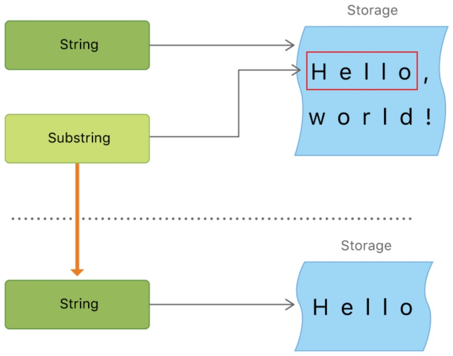

<center>
  <font size="5">
  	<b>子字符串</b>
  </font>
</center>

当你获得了一个字符串的子字符串——比如说，使用下标或者类似 prefix(_:) 的方法——结果是一个 Substring 的实例，不是另外一个字符串。Swift 中的子字符串拥有绝大部分字符串所拥有的方法，也就是说你可以用操作字符串相同的方法来操作子字符串。总之，与字符串不同，在字符串上执行动作的话你应该使用子字符串执行短期处理。当你想要把结果保存得长久一点时，你需要把子字符串转换为 String 实例。比如说：

```swift
let greeting = "Hello, world!"
let index = greeting.firstIndex(of:",") ?? greeting.endIndex
let beginning = greeting[..<index]
// beginning is "Hello"
// Convert the result to a String for long-term storage.
let newString = String(beginning)
```

子字符串并不适合长期保存——因为它们重用了原字符串的内存，只要这个字符串有子字符串在使用中，那么这个字符串就必须一直保存在内存里。



