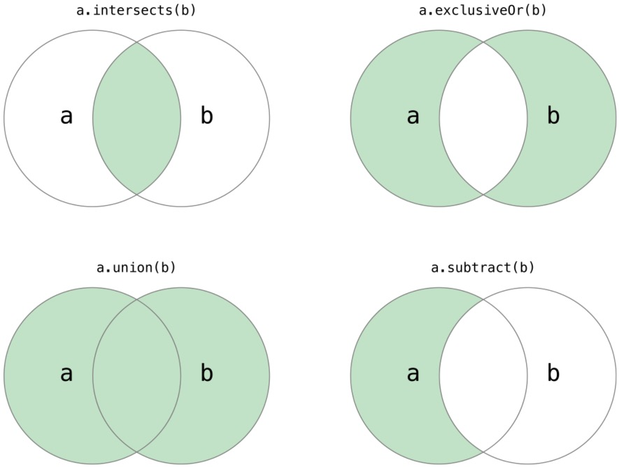
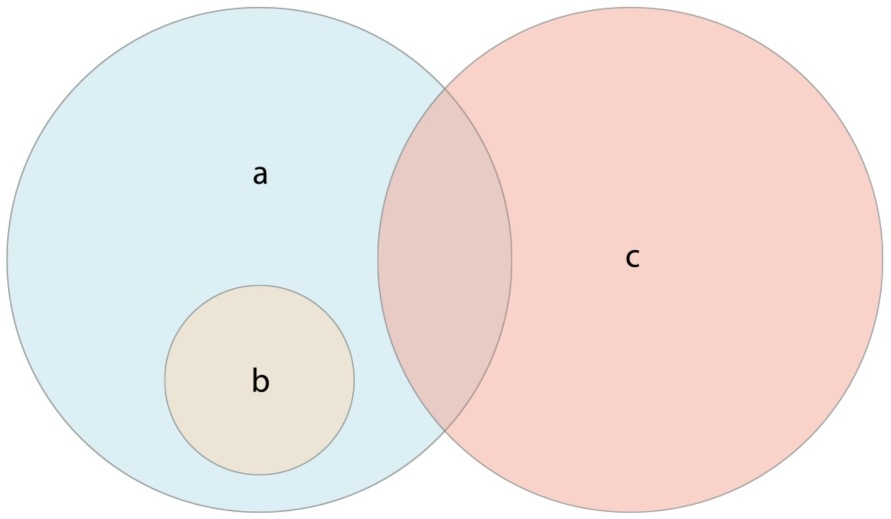

<center>
  <font size="5">
  	<b>执行合集操作</b>
  </font>
</center>

[toc]

####1. 基本合集操作

下边的示例描述了两个合集—— a和 b——在各种合集操作下的结果，用阴影部分表示。



+ 使用 `intersection(_:)`方法来创建一个只包含两个合集共有值的新合集；
+ 使用 `symmetricDifference(_:)`方法来创建一个只包含两个合集各自有的非共有值的新合集；
+ 使用 `union(_:)`方法来创建一个包含两个合集所有值的新合集；
+ 使用 `subtracting(_:)`方法来创建一个两个合集当中不包含某个合集值的新合集。

```swift
let oddDigits: Set = [1, 3, 5, 7, 9]
let evenDigits: Set = [0, 2, 4, 6, 8]
let singleDigitPrimeNumbers: Set = [2, 3, 5, 7]
oddDigits.union(evenDigits).sorted()
// [0, 1, 2, 3, 4, 5, 6, 7, 8, 9]
oddDigits.intersection(evenDigits).sorted()
// []
oddDigits.subtracting(singleDigitPrimeNumbers).sorted()
// [1, 9]
oddDigits.symmetricDifference(singleDigitPrimeNumbers).sorted()
// [1, 2, 9]
```

#### 2. 合集成员关系和相等性

下面的示例描述了三个合集—— a， b和 c——用重叠区域代表合集之间值共享。合集 a是合集 b的超集，因为 a包含 b的所有元素。相反地，合集 b是合集 a的子集，因为 b的所有元素被 a包含。合集 b和合集 c是不相交的，因为他们的元素没有相同的。



+ 使用“相等”运算符 ( == )来判断两个合集是否包含有相同的值；
+ 使用 `isSubset(of:)` 方法来确定一个合集的所有值是被某合集包含；
+ 使用 `isSuperset(of:)` 方法来确定一个合集是否包含某个合集的所有值；
+ 使用 `isStrictSubset(of:)` 或者 `isStrictSuperset(of:)` 方法来确定是个合集是否为某一个合集的子集或者超集，但并不相等；
+ 使用 `isDisjoint(with:)` 方法来判断两个合集是否拥有完全不同的值。

