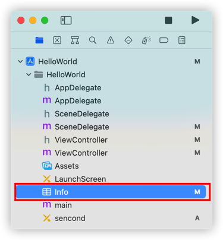

[toc]

### 1. Xcode Version 13.0 (13A233)

1.  选中工程文件列表中的 `Info` 文件

    

2.  在如下路径中添加 `Storyboard Name` 节点，设置其值为要设置的 storyboary 文件名

    

>   提示：
>
>   要设置一个 storyboard 文件成为初始化界面请参阅 <[将一个storyboard设置成初始界面](../Storyboard/将一个storyboard设置成初始界面.md)>。

