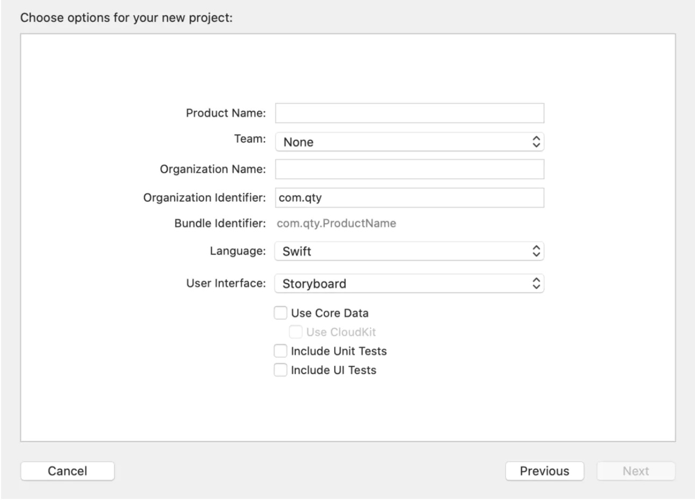

由于在XCode11版本后，苹果添加了SwiftUI的界面布局功能，它会在创建的工程中生成SceneDelegate.swift类。如果我们将项目的版本设置低于iOS 13，在编译项目时将会报错，提示UIScene类只能在iOS 13及以上版本上使用等错误。为了达到降低目标版本的目的，需要修改以下几个方面的代码：

1. 布局方法修改
    在创建工程时，选择使用Storyboard的布局方法。

    

    image.png

2. 修改SceneDelegate.swift类
    因为该类只在iOS 13后使用，可以将其标记为iOS 13可用。修改代码如下：

```kotlin
import UIKit
@available(iOS 13.0, *)
class SceneDelegate: UIResponder, UIWindowSceneDelegate {

    var window: UIWindow?
...
}
```

1. 还需要修改AppDelegate.swift类
    因为iOS 13版本的设备会走SceneDelegate.swift类，而低于iOS 13的设备将会走该类，因此需要在该类中添加window变量，不然应用启动后将会是黑屏。代码修改如下：

```kotlin
import UIKit

@UIApplicationMain
class AppDelegate: UIResponder, UIApplicationDelegate {

    var window: UIWindow?
...
}
```

由于自动生成的AppDelegate.swift类中还有方法使用到了高版本的类，因此需要将其标注为指定版本后使用。AppDelegate.swift的完整代码如下：

```swift
import UIKit

@UIApplicationMain
class AppDelegate: UIResponder, UIApplicationDelegate {

    var window: UIWindow?

    func application(_ application: UIApplication, didFinishLaunchingWithOptions launchOptions: [UIApplication.LaunchOptionsKey: Any]?) -> Bool {
        // Override point for customization after application launch.
        return true
    }

    // MARK: UISceneSession Lifecycle

    @available(iOS 13.0, *)
    func application(_ application: UIApplication, configurationForConnecting connectingSceneSession: UISceneSession, options: UIScene.ConnectionOptions) -> UISceneConfiguration {
        // Called when a new scene session is being created.
        // Use this method to select a configuration to create the new scene with.
        return UISceneConfiguration(name: "Default Configuration", sessionRole: connectingSceneSession.role)
    }

    @available(iOS 13.0, *)
    func application(_ application: UIApplication, didDiscardSceneSessions sceneSessions: Set<UISceneSession>) {
        // Called when the user discards a scene session.
        // If any sessions were discarded while the application was not running, this will be called shortly after application:didFinishLaunchingWithOptions.
        // Use this method to release any resources that were specific to the discarded scenes, as they will not return.
    }

}
```

注意：如果需要使用代码指定第一个进入的界面需要在SceneDelegate.swift和AppDelegate.swift都指定。