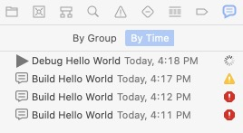

  
  	<b>Xcode项目窗口</b>
  

[toc]

#### 1. 工具栏

#### 2. 项目导航图

#####2.1 项目导航面板（Project Navigator)

##### 2.2 源代码管理导航面板（Source Control Navigator)

##### 2.3 符号导航面板 (Symbol Navigator)

##### 2.4 查找导航面板（Find Navigator）

##### 2.5 问题导航面板（Issues Navigator）

##### 2.6 测试导航面板（Test Navigator）

##### 2.7 调试导航面板（Debug Navigator）

如果你对调试很陌生，可以查阅相关在线文档：<http://developer.apple.com/library/content/documentation/DeveloperTools/Conceptual/debugging_with_xcode/>。

##### 2.8 断点导航面板（Breakpoint Navigator）

##### 2.9 日志导航面板（Report Navigator）

