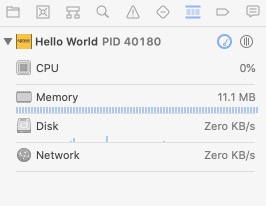
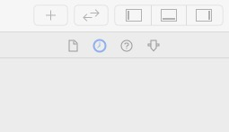
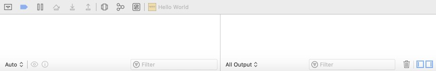

  
  	<b>显示或隐藏面板快捷键</b>
  

1. 显示或隐藏导航面板（ Navigator ）快捷键

快捷键：<kbd>Command</kbd>+<kbd>0</kbd>

2. 显示或隐藏检查面板（ Inspector ）快捷键

快捷键：<kbd>Option</kbd>+<kbd>Command</kbd>+<kbd>0</kbd>

3. 显示调试区域面板（Debug Area）快捷键

快捷键：<kbd>Shift</kbd>+<kbd>Command</kbd>+<kbd>Y</kbd>

​      

 

