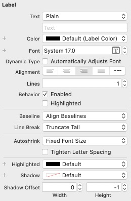

<b>Label 属性说明</b>

**1. Text**

设置 UILabel 的内容是普通文本内容还是富文本内容。

**2. Color**

设置文字颜色。

**3. Font**

设置文字字体。

**4. Dynamic Type**

+ Automatically Adjusts Font：是否自动调整字体

**5. Alignment**

设置对齐方式

**6. Lines**

设置限制显示行数，如果设置为0，表示不限制行数。

**7. Behavior**

+ Enabled
+ Highlighted

**8. Baseline**

设置基线对齐方式

**9. Line Break**

设置多行显示时的字符换行的截断方式。

**10. Autoshirnk**

设置自动缩放方式。

**11. Tighten Letter Spacing**

**12. Highlighted**

设置高亮颜色

**13. Shadow**

设置阴影颜色

**14. Shadow Offset**

设置阴影偏移值。