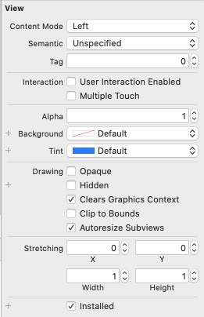

<b>视图属性说明</b>

**1. Content Mode**

视图对齐方式，有 Scale To Fill、 Aspect Fit、Aspect Fill、Redraw、Center、Top、Bottom、Left、Right、Top Left、Top Right、Bottom Left、Bottom Right。

**2. Semantic**

这是 iOS 9 新添加的属性，它可以让你设定视图在某些语言的（比如希伯来语和阿拉伯语）地区使用从右到左的阅读顺序进行渲染。

**3. Tag**

Tag主要用于在设置控件事件处理方法中通过 sender 参数出传递给操作方法的控件到底是哪一个。

**4. Interaction**

+ User Interaction Enabled：是否允许控件用户进行交互。
+ Multiple Touch：是否支持多点触摸时间

**5. Alpha**

设置视图的透明度，值为0.0 ~ 1.0。如果值小于1.0，即使图像背后没有任何内容，应用程序也会在运行时占用处理器周期来叠加半透明视图后面的空白区域。因此，除非有充分的理由，否则一般要将该值设置为1. 0。

**6. Background**

设置视图的背景颜色。

**7. Tint**

设置视图的高光颜色。

**8. Drawing**

+ Opaque：选中时相当于告诉 iOS 当前视图的背后没有需要绘制的内容，同时允许绘图方法通过一些优化来加速当前视图的绘制。
+ Hidden：视图是否隐藏。
+ Clears Graphics Context：如果选择它，iOS 会在实际绘制对象之前清空所有区域的内容为透明。
+ Clip to Bounds：是否裁剪边框以外的内容。
+ Autoresize Subviews：是否自动调整子视图大小。

**9. Stretching**

该选项用于保持视图的外边缘不变，仅拉伸中间部分，而不是均匀拉伸视图的全部内容。