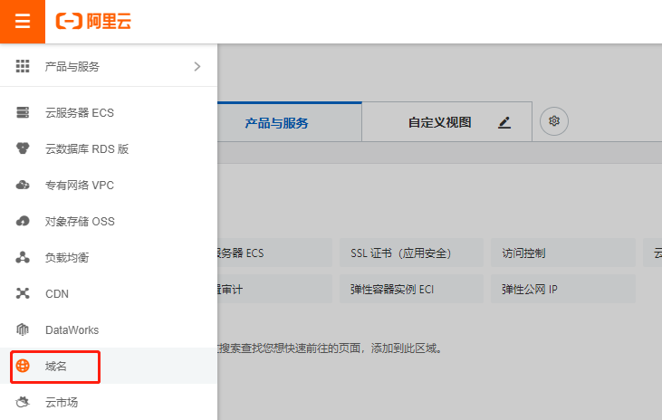
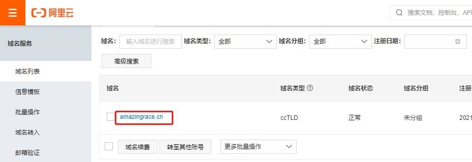
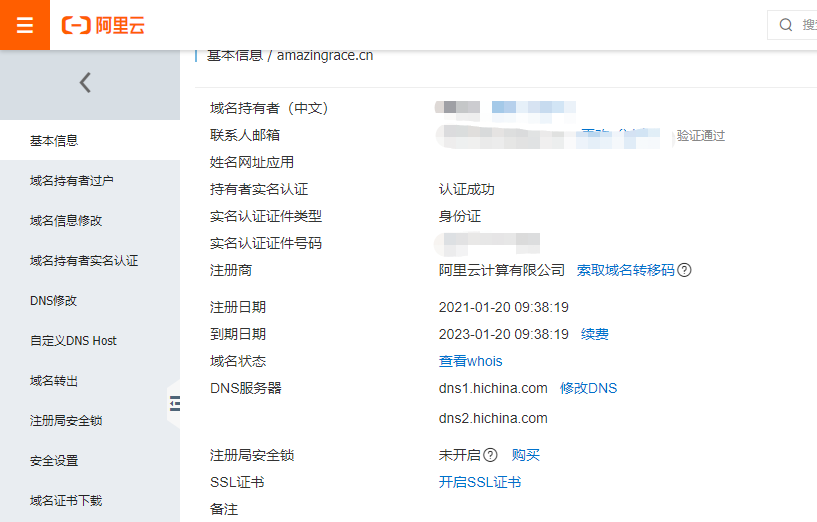
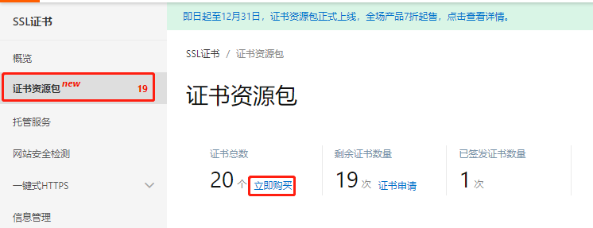
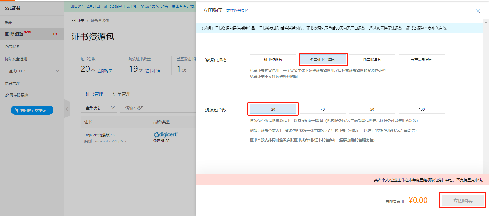
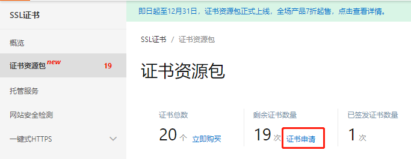
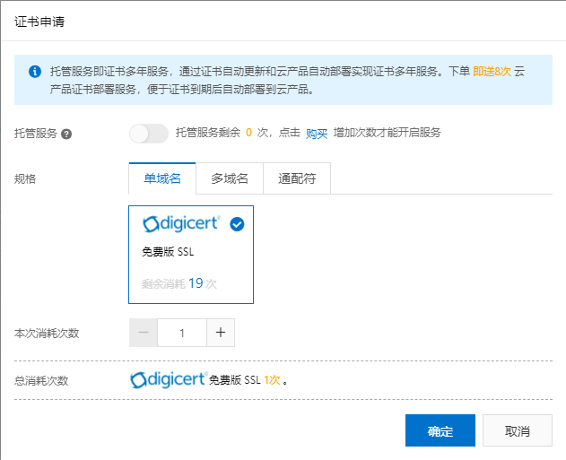
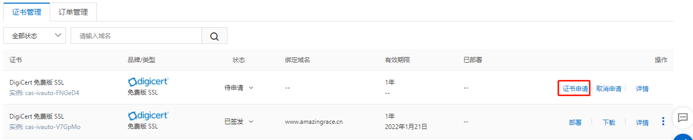
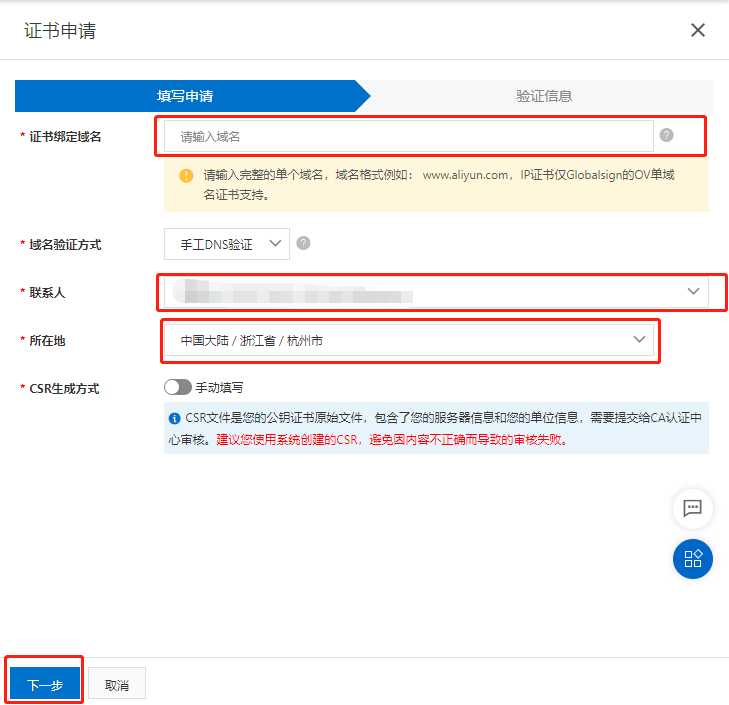
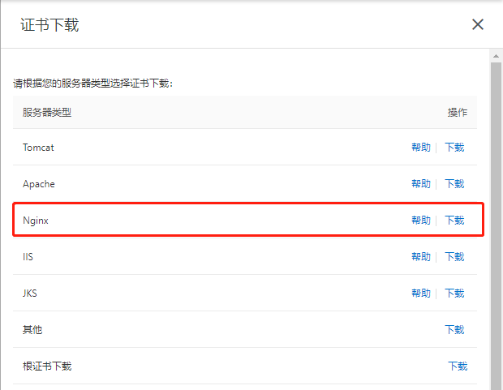

[toc]

### 一、购买 SSL 证书

1. 进入域名控制台

   

2. 进入域名信息界面

   

3. 点击 `开启SSL证书` 按钮，进入SSL证书管理控制台。

   

4. 点击左侧的 `证书资源包` ，在右边点击 `立即购买`。

   

5. 在弹出的界面中的资源包规格选择 `免费证书扩容包`，资源包个数选择 `20`，然后点击 `购买`。

   

6. 在证书资源包页面点击 `证书申请` 按钮。

   

7. 在弹出的证书申请弹框中，规格选择 `单域名`，本次消耗次数输入 `1`，点击 `确定`。

   

8. 在 `证书管理` 列表中选择新申请的证书，点击 `证书申请`。

   

9. 在弹出的证书申请界面中输入相关信息点击 `下一步`，在验证信息界面中点击 `验证`，如果验证成功，则点击 `确定`。

   

10. 申请成功后点击证书管理列表中申请成功的证书后面的 `下载` 按钮。

    

11. 在弹出的证书下载界面中点击 Nginx 后面的 `下载` 按钮下载证书（没有Node对应的证书，可以使用 Nginx 代替）。

    

12. 将下载下来的压缩包解压，得到 key 和 pem 文件。将这两个文件拷贝到服务器的指定文件夹下（比如：`/home/sslkey`)

13. 可以使用下面的代码实现网站的 https 服务。

    ```js
    // load http module
    var http = require('http');
    var https = require('https');
    let fs = require('fs');
    
    // Configuare https
    const httpsOption = {
        key: fs.readFileSync("/home/sslkey/www.amazingrace.cn.key"),
        cert: fs.readFileSync("/home/sslkey/www.amazingrace.cn.pem")
    }
    
    function app(req, res) {
        // content header
        res.writeHead(200, {'content-type': 'text/plain'})
        
        // write message and signal communication is complete
        res.end("Hello, World!\n")
    }
    
    // create http server
    http.createServer(app).listen(80)
    https.createServer(httpsOption, app).listen(443);
    
    console.log('Server running on 80')
    ```

    