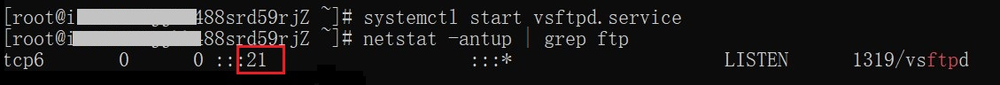
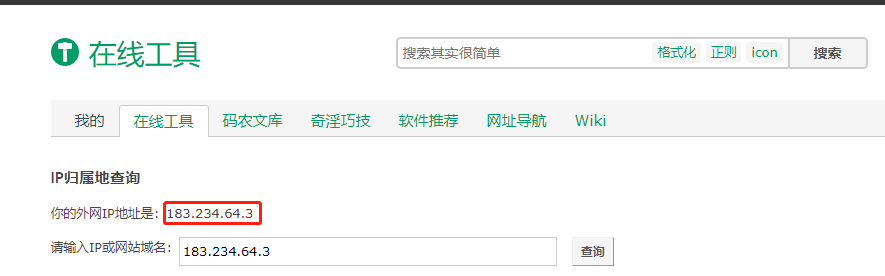
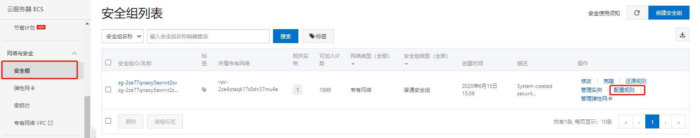
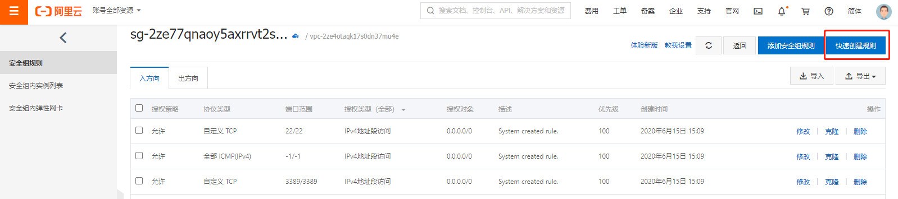
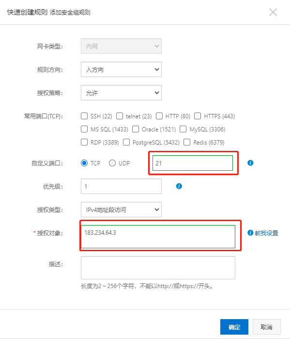
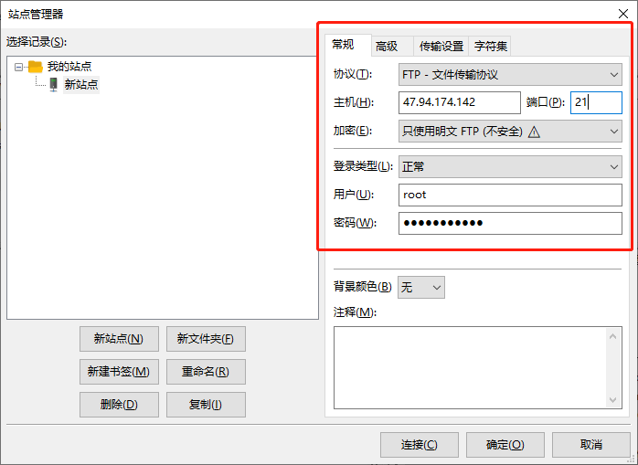
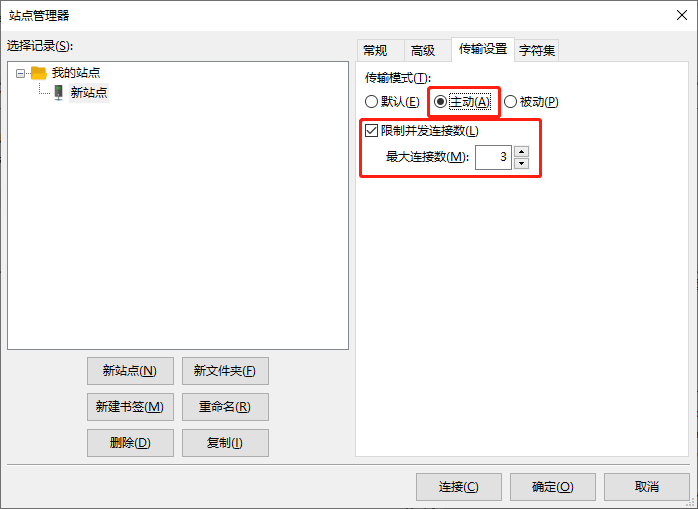
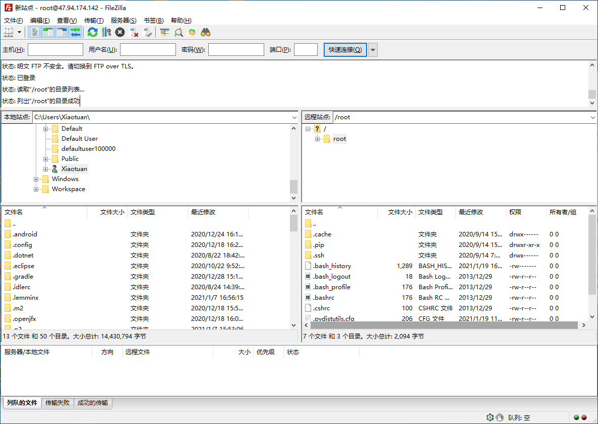
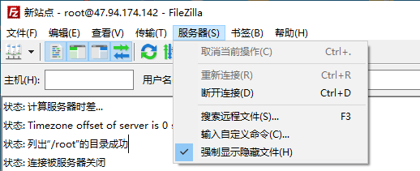

[toc]

### 1. 阿里云配置 FTP

首先我们需要对自己ECS服务器的安全组惊醒配置，开放21端口:

```shell
yum install -y vsftpd   # 安装vsftpd
systemctl enable vsftpd.service #设置FTP服务开机自启动
systemctl start vsftpd.service  #启动FTP服务
netstat -antup | grep ftp #运行以下命令查看FTP服务监听的端口
```



出现这样的结果就是已经成功了。

> 提示：详细配置请参考[FTP介绍以及阿里云ECS配置](https://developer.aliyun.com/article/773594?spm=a2c6h.13813017.0.dArticle738638.4c8899bbr3zTeU)

### 2. 打开服务器 21 端口

#### 2.1 查看本机外网 IP 地址

可以通过 <https://tool.lu/ip/> 网站查看本机的外网地址：



#### 2.2 配置 21 端口安全策略

1. 打开阿里云服务器控制台。

2. 在左侧列表中点击**网络与安全**下的 `安全组` ，在右边的安全组列表中，点击默认安全组行右边的 `配置规则` 按钮。

   

3. 在配置规则页面点击 `快速创建规则` 按钮。

   

4. 在弹出的对话框中的自定义端口输入框中输入端口号 `21`，在授权对象输入框中输入 `自己电脑所连接的外网IP`。

   

   5. 点击 `确定` 按钮创建规则。

   ### 3. 允许 root 用户进行 FTP 通信

   1. 修改服务器中 `/etc/vsftpd/ftpusers` 文件，将 `root` 用户注释掉。
   2. 修改服务器中 `/etc/vsftpd/user_list` 文件，将 `root` 用户注释掉。
   3. 执行 `systemctl restart vsftpd.service` 命令重启 vsftpd 服务。

### 4. 配置 FileZilla 软件

1.安装完毕后，启动FileZilla软件，将语言切换至中文。点击Edit-Settings-Language-Chinese（Simplified）（zh_CN）。重新启动FileZilla后，点击新建站点：单击 **文件 > 站点管理器 > 新站点** 。

- 新站点，名字可任意填写，如填写为：新站点。
- 主机，填入控制台中FTP登录主机地址或主机IP地址，如：121.XX.XX.XX 。
- 端口，填写21 。
- 协议，选择 FTP-文件传输协议 。
- 加密，选择只使用普通FTP 。
- 登录类型。选择 正常 。
- 用户，填写主机的用户名（主机FTP用户名）。
- 密码，填写主机的FTP密码。



2. 切换到 `传输设置` 选项卡，在传输模式中选择 `主动` 选项，勾选 `限制并非连接数量`，在最大连接数量输入框中输入服务器 CPU 核数（物理核数，不是逻辑核数）。

   

3. 连接远程站点：单击 **连接** ，即可连接至主机目录。

   

4. 显示隐藏文件：单击 `服务器` -> `强制显示隐藏文件`。

   

> 提示：参考文档 [《FileZilla使用手册》](https://help.aliyun.com/knowledge_detail/36243.html?spm=a2c4g.11186623.2.5.619171f52zaoyH)。

> 提示：可以在 [网站上传/下载](https://help.aliyun.com/knowledge_list/36177.html?spm=a2c4g.11186623.6.554.1937438eajo0z2) 页面中查看更多关于上传/下载相关的问题解决方法。